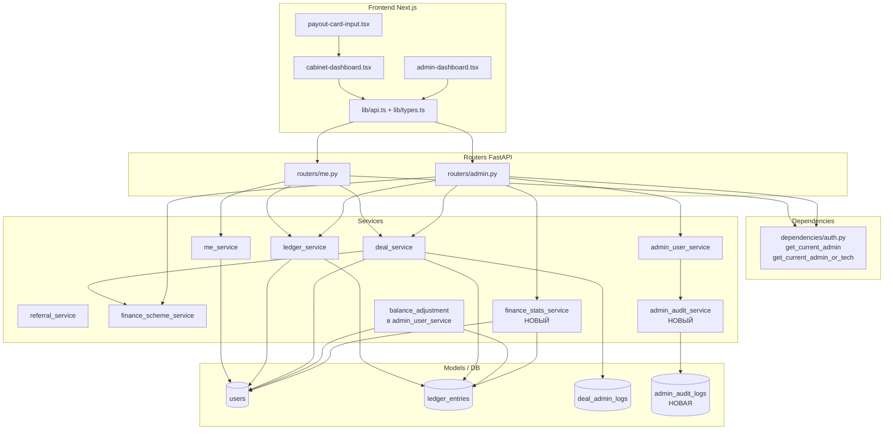
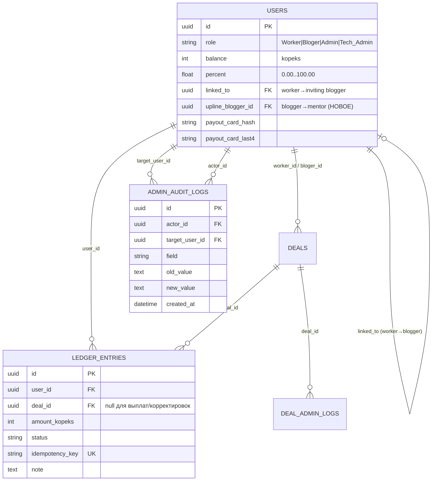

# Дизайн-документ

## Overview

Документ описывает техническое решение для восьми направлений администрирования и финансов платформы (FastAPI + async SQLAlchemy + Alembic + Pydantic v2 на бэкенде, Next.js + React Query + TypeScript на фронтенде). Все денежные суммы — целые числа в копейках.

Решение охватывает три класса задач:

1. **Отображение данных (UI + схемы):** причина отклонения сделки (Req 1), причина отклонения выплаты (Req 2), финансовый дашборд (Req 8).
2. **Новая функциональность:** ручная корректировка баланса (Req 3), расширенная роль «Тех-админ» с аудитом (Req 5).
3. **Исправление дефектов:** сохранение карты выплаты (Req 4), доля платформы (Req 6), назначение реферальной доли (Req 7).

### Сводка по расследованию дефектов

| # | Симптом | Корневая причина (по анализу кода) | Стратегия исправления |
|---|---------|------------------------------------|------------------------|
| 4 | Карта выплаты не сохраняется | `services/me_service.py::set_me_payout_card` корректен, но возвращает `503`, когда `settings.payout_card_pepper` пустой (дефолт `""` в `core/settings.py`); в развёрнутом `.env` переменная `PAYOUT_CARD_PEPPER` не задана. Вторично — фронтенд `payout-card-input.tsx` жёстко требует ровно 16 цифр (`isValidLength = raw.length === expectedLen`), блокируя валидные карты длиной 13/18/19. Миграция `i3j4k5l6m7n8` уже добавила колонки `payout_card_hash`/`payout_card_last4`, поэтому проблемы схемы нет. | Сконфигурировать `PAYOUT_CARD_PEPPER`; сохранить отличимую ошибку конфигурации (Req 4.6); согласовать фронтенд-валидацию длины с диапазоном 13–19; не зависеть от токена ЮKassa (уже выполняется). |
| 6 | Баланс пользователя «Платформа» показывает полную сумму 7777 вместо доли ≈3889 | `distribute_price_kopeks` математически корректен (`pk = price − wk − bk − uk`), `_accrue_paid_deal` зачисляет платформе только `pk`. Полная сумма на балансе — результат **накопления по нескольким сделкам** (2 сделки × 3889 = 7778 ≈ 7777) и/или повторных прогонов неидемпотентных seed-скриптов (`seed_test_deals.py` создаёт новые сделки при каждом запуске). Дашборд при этом читает «сырой» `User.balance`. | Гарантировать инварианты распределения свойствами (PBT); подтвердить идемпотентность начислений по `deal_id`; в дашборде вычислять накопленную долю платформы из **посделочных записей журнала** (`idempotency_key` вида `deal:{id}:paid:platform`), а не из сырого баланса; сделать seed-скрипты идемпотентными. |
| 7 | Реферальная доля уходит «не туда» / назначается, когда аплайна нет | `User.linked_to` перегружен: `set_worker_linked_to` пишет `worker.linked_to = blogger_id` (смысл «работник → пригласивший блогер»), но `_accrue_paid_deal` читает `bloger_user.linked_to` как «блогер → наставник-аплайн». Семантики смешаны: значение, заданное реферальным потоком регистрации, интерпретируется как аплайн. | Ввести отдельную колонку `User.upline_blogger_id` для наставника-блогера; `_accrue_paid_deal` читает **только** её; `linked_to` остаётся исключительно связью «работник → блогер»; аплайн валиден только если это существующий `Bloger`, отличный от самого блогера; наставник по умолчанию не назначается никогда. |

## Architecture

### Слои системы

Изменения вписываются в существующую слоистую архитектуру без её перестройки:



### Ключевые архитектурные решения

- **Аудит как отдельная таблица.** Для Req 5.6 вводится `admin_audit_logs` (изменения процента и карты партнёра). Журнал сделок (`deal_admin_logs`) и финансовый журнал (`ledger_entries`) остаются специализированными и не смешиваются с аудитом административных действий над пользователями.
- **Разделение семантики реферальных связей.** Вместо перегруженного `linked_to` вводится `upline_blogger_id` — единственный источник истины для аплайна (Req 7).
- **Деривация финансовых показателей из журнала, а не из баланса.** Накопленная доля платформы и заработок по ролям вычисляются из `ledger_entries` (посделочные идемпотентные записи), что устраняет искажения «сырого» баланса (Req 6, Req 8).
- **Расширение прав через зависимость, а не дублирование эндпоинтов.** Вводится `get_current_admin_or_tech`; операции уровня владельца (управление другими администраторами) остаются на `get_current_admin`.

## Components and Interfaces

### Req 1 — Причина отклонения сделки

**Источник данных.** Причина уже сохраняется: `admin_patch_deal_status` пишет `DealAdminLog(action="status_patch", new_status=REJECTED, reason=...)`. Нужно поднять её в `DealRead` и UI.

**Backend.**
- `services/deal_service.py`: новая функция-хелпер
  ```python
  async def get_latest_rejection_reason(deal_id: uuid.UUID, db: AsyncSession) -> str | None:
      """Последняя причина отклонения: последняя запись DealAdminLog
      с action='status_patch' и new_status=REJECTED для сделки. None — если нет."""
  ```
  Выбор: `select(DealAdminLog.reason).where(deal_id==..., action=='status_patch', new_status==REJECTED).order_by(created_at.desc()).limit(1)`.
- `deal_to_read` дополняется: если `deal.status == REJECTED`, проставляет `rejection_reason = await get_latest_rejection_reason(...)`; иначе `None`.
- Валидация длины причины уже задана схемой `AdminDealStatusPatch.reason` (`min_length=1, max_length=4000`). Требование Req 1.1/1.8 говорит о диапазоне 1–1000 для сделки — **сужаем** ограничение для статуса до `max_length=1000` (см. Schema changes), сохраняя текущий статус при нарушении (валидация Pydantic вернёт 422 до изменения состояния).

**Schema changes (`schemas/deal.py`).**
- `DealRead`: добавить `rejection_reason: str | None = None` с описанием «Последняя причина отклонения; null — причина не сохранена».
- `AdminDealStatusPatch.reason`: ограничение `max_length=1000` (Req 1.8). (Прочие админ-действия со сделкой, использующие 4000, остаются как есть — это другие операции.)

**Frontend.**
- `lib/types.ts`: `DealRead` += `rejection_reason: string | null`.
- `admin-dashboard.tsx` (карточка сделки) и `cabinet-dashboard.tsx` (карточка/модалка сделки участника): при `status === "REJECTED"` отображать блок «Причина отклонения». Если `rejection_reason` пуст/`null` — текстовый плейсхолдер «Причина не указана» (Req 1.9/1.10).

### Req 2 — Причина отклонения выплаты

**Источник данных.** `LedgerEntry.note` уже присутствует в `LedgerEntryRead`. `admin_patch_ledger_status` сохраняет `note` при переводе в `rejected`. Это чисто UI-задача плюс выравнивание валидации длины.

**Backend.**
- `schemas/ledger.py::AdminLedgerStatusPatch.note`: оставить `max_length=4000` (Req 2.1/2.7 — диапазон 1–4000). При превышении Pydantic вернёт 422, статус записи не меняется.

**Frontend.**
- В кабинете (`cabinet-dashboard.tsx`) и админке (`admin-dashboard.tsx`) в списках журнала для записей `status === "rejected"`: показывать `note` рядом с записью; если `note` пуст/`null` — плейсхолдер «Причина не указана» (Req 2.5/2.6). Места рендеринга уже существуют (`entry.note || "—"`); требуется заменить «—» на осмысленный плейсхолдер именно для `rejected` и обеспечить отображение и в мобильном, и в десктоп-варианте.

### Req 3 — Ручная корректировка баланса

**Эндпоинт (`routers/admin.py`).**
```
POST /admin/users/{user_id}/balance-adjustment
  body: AdminBalanceAdjustmentRequest { amount_kopeks: int, reason: str }
  resp: AdminBalanceAdjustmentResponse { user: AdminUserRead, ledger_entry: LedgerEntryRead }
  guard: get_current_admin_or_tech  (управленческая операция уровня Тех-админ)
```

**Сервис (`services/admin_user_service.py`).**
```python
async def admin_adjust_user_balance(
    user_id: uuid.UUID,
    amount_kopeks: int,
    reason: str,
    actor: User,
    db: AsyncSession,
) -> tuple[User, LedgerEntry]:
```
Алгоритм (атомарно, в одной транзакции, с `with_for_update` на пользователе):
1. Валидация суммы: `amount_kopeks != 0` и `-99_999_999_999 ≤ amount ≤ 99_999_999_999` (Req 3.3/3.4). Иначе `422`.
2. Валидация причины: `reason.strip()` непуст и `len(reason) ≤ 500` (Req 3.6). Иначе `422` (через Pydantic-схему).
3. Блокировка строки пользователя; при уменьшении (`amount < 0`) проверка доступных средств: `new_balance = user.balance + amount`; если `new_balance < reserved`, где `reserved = _reserved_payout_kopeks(user_id)` (статусы `payout_request`, `freeze`, `pending_confirmation`) — `409`/`400` с признаком недостатка доступных средств (Req 3.5), баланс не меняется.
4. Изменить баланс: `user.balance = new_balance`.
5. Создать `LedgerEntry(user_id=user_id, deal_id=None, amount_kopeks=amount, status=COMPLETED, note=reason.strip(), idempotency_key=f"adj:{uuid4()}")`. `idempotency_key` уникален, чтобы не конфликтовать с посделочными ключами.
6. Записать в аудит идентификатор администратора (Req 3.7). Так как `LedgerEntry` не хранит `admin_id`, фиксируем исполнителя в `admin_audit_logs` (field `balance_adjustment`) с суммой в `new_value`. Это переиспользует таблицу аудита из Req 5 и закрывает Req 3.7 без расширения `ledger_entries`.
7. `commit`. Если запись журнала/аудита упала — транзакция откатывается целиком, баланс сохраняет исходное значение (Req 3.9, гарантируется единой транзакцией + `rollback` в обработчике).

**Авторизация.** Эндпоинт под `get_current_admin_or_tech`; запрос от неадминистратора → `403` без изменения баланса (Req 3.8).

**Schema changes (`schemas/admin.py`).**
```python
class AdminBalanceAdjustmentRequest(BaseModel):
    amount_kopeks: Annotated[int, Field(ge=-99_999_999_999, le=99_999_999_999)]
    reason: Annotated[str, Field(min_length=1, max_length=500)]

    @model_validator(mode="after")
    def _validate(self):  # ноль и пробельная причина
        if self.amount_kopeks == 0:
            raise ValueError("Сумма корректировки не может быть нулевой")
        if not self.reason.strip():
            raise ValueError("Причина не может состоять из пробелов")
        return self

class AdminBalanceAdjustmentResponse(BaseModel):
    user: AdminUserRead
    ledger_entry: LedgerEntryRead
```

**Frontend.** В `admin-dashboard.tsx` (карточка пользователя) — форма «Корректировка баланса» (сумма в рублях → копейки, причина). `lib/api.ts`: `adjustUserBalance(id, { amount_kopeks, reason })`.

### Req 4 — Сохранение карты выплаты (исправление)

**Корневая причина:** `PAYOUT_CARD_PEPPER` не задан в окружении → `set_me_payout_card` отдаёт `503` (Req 4.6 — желаемое поведение). Логика сервиса корректна и не зависит от токена ЮKassa (Req 4.5).

**Изменения.**
- **Конфигурация/деплой:** задать `PAYOUT_CARD_PEPPER` в `.env`/Railway Variables. Документировать обязательность переменной для функции выплат. Поведение «отключено без секрета» сохраняется и явно отличимо от успеха (отдельный код `503` + сообщение).
- **Backend `set_me_payout_card`:** логика без изменений; добавить только ясное сообщение об ошибке конфигурации (уже есть). Подтвердить порядок проверок: роль (`403`) → секрет (`503`) → длина 13–19 (`400`) → Луна (`400`) → сохранение хеша и last4 (Req 4.1–4.4, 4.7, 4.8). При любой ошибке валидации ранее сохранённые `payout_card_hash`/`payout_card_last4` не трогаются (присваивание происходит только после успешных проверок).
- **Frontend `payout-card-input.tsx`:** заменить жёсткое `isValidLength = raw.length === expectedLen` (16/15) на диапазон 13–19 цифр (для не-AmEx) с сохранением Luhn-проверки, чтобы валидные карты МИР/Maestro/др. не блокировались. Кнопка активна при длине в диапазоне и валидном Luhn.

`PayoutCardSet.card_number` в `schemas/me.py` остаётся `min_length=12, max_length=32` (нормализация и точная проверка 13–19 — на сервере).

### Req 5 — Расширенная роль «Тех-админ»

**Enum роли (`enums/user.py`).** Добавить значение:
```python
class UserRole(str, enum.Enum):
    WORKER = "Worker"
    BLOGER = "Bloger"
    ADMIN = "Admin"
    TECH_ADMIN = "Tech_Admin"
```
Нативный PG enum `user_role` расширяется миграцией `ALTER TYPE user_role ADD VALUE IF NOT EXISTS 'Tech_Admin'` (паттерн как в `l6m7n8o9p0q1`, в `autocommit_block`).

**Единственность владельца (`models/user.py`).** Частичный уникальный индекс `uq_users_single_admin` (`WHERE role = 'Admin'`) **остаётся как есть** — он ограничивает только владельца-`Admin`, не затрагивая `Tech_Admin`. Лимит «0..10 тех-админов» (Req 5.1) проверяется на уровне сервиса (а не БД), т.к. это бизнес-правило с переменной границей.

**Зависимость авторизации (`dependencies/auth.py`).**
```python
async def get_current_admin_or_tech(user = Depends(get_current_user)) -> User:
    if user.role not in (UserRole.ADMIN, UserRole.TECH_ADMIN):
        raise HTTPException(403, "Доступно администраторам")
    return user
```
`get_current_admin` (только `Admin`) сохраняется и используется для операций над административными аккаунтами (Req 5.8). Большинство существующих admin-эндпоинтов (обзор, пользователи-партнёры, проценты, карты, сделки, журнал, дашборд, корректировка баланса) переключаются на `get_current_admin_or_tech`. Операции «создать/сменить роль/деактивировать/удалить аккаунт с ролью `Admin` или `Tech_Admin`» остаются под `get_current_admin`.

**Управление партнёрами (`services/admin_user_service.py::admin_patch_user`).**
- Процент: диапазон `0.00..100.00`, 2 знака (Req 5.2, 5.9). Валидация в `AdminUserPatch.percent` (`ge=0, le=100`) + округление/проверка точности.
- Карта партнёра: новый путь — админ задаёт карту партнёру. Принимать номер 13–19 цифр, хранить только last4 + hash (Req 5.3, 5.10). Реализуется через переиспользование `utils/card_hash` в сервисе (та же логика, что в `set_me_payout_card`, вынесенная в общий хелпер `compute_card_hash_and_last4(pan) -> (hash, last4)`).
- **Защита последнего владельца (Req 5.7):** перед деактивацией/удалением/понижением роли, которые затронули бы аккаунт `Admin`, проверять, что останется ≥1 активный `Admin`. Текущие проверки в `admin_patch_user`/`admin_delete_user` усиливаются: запрет на действия, после которых `count(active Admin) == 0`.
- **Разграничение прав (Req 5.5, 5.8):** операции над аккаунтами `Admin`/`Tech_Admin` (роль, активность, удаление) разрешены только актору с ролью `Admin`. Тех-админ, пытающийся изменить административный аккаунт, получает `403`.
- **Аудит (Req 5.6):** при изменении `percent` или карты партнёра создаётся запись `admin_audit_logs` (актор, партнёр, поле, старое/новое значение, время). Для карты в `old_value`/`new_value` пишется только маскированное представление (last4), без PAN.

**Эндпоинты.**
- `PATCH /admin/users/{id}` — расширяется (процент/карта/роль/активность) с разграничением прав.
- `POST /admin/users/{id}/payout-card` (новый, уровень Тех-админ) — задать карту партнёра: `AdminPartnerCardSet { card_number }`.
- `GET /admin/users/{id}/audit` (новый) — история изменений процента и карты партнёра для UI (Req 5.4): `AdminAuditListResponse`.

**Schema changes (`schemas/admin.py`).**
- `AdminUserRead`: добавить `is_owner_admin: bool` (вычисляемое: `role == ADMIN`) — для UI-логики; `role` уже включает новое значение.
- `AdminUserPatch.percent`: `Field(ge=0, le=100)`.
- Новые: `AdminPartnerCardSet`, `AdminAuditEntryRead`, `AdminAuditListResponse`.

**Frontend.** В `admin-dashboard.tsx`: для партнёров отображать процент, last4 карты, баланс, статус активности и историю изменений (Req 5.4). Разграничение UI: блоки управления админ-аккаунтами видимы/активны только владельцу-`Admin`.

### Req 6 — Корректная доля платформы (исправление + гарантии)

**Подтверждение корректности кода.** `distribute_price_kopeks` возвращает `(wk, bk, uk, pk)` с `pk = price − wk − bk − uk`; сумма всегда равна `price`, доли неотрицательны при неотрицательных весах. `_accrue_paid_deal` зачисляет платформе только `pk`. Для базы 7777 и весов по умолчанию (2000/5000/1000/8000, сумма 16000): `wk=972, bk=2430, uk=486, pk=3889` (Req 6.3) — совпадает.

**Изменения.**
1. **Идемпотентность (Req 6.4):** подтверждается существующим механизмом — `_paid_bundle_exists` + уникальный `idempotency_key` (`deal:{id}:paid:{role}`). Усиление: оборачивать запись начислений так, чтобы повторный вызов не добавлял строк и не менял балансы (уже выполняется ранним `return`). Property-тест покрывает двойной вызов.
2. **Проверка системного счёта (Req 6.6):** уже есть — при отсутствии `platform_user` бросается `500`. Уточняем: до любого изменения балансов (порядок в коде уже верный — `platform_user` достаётся до `credit`), и сообщение явно указывает на несконфигурированный системный счёт.
3. **Дашборд читает журнал, а не баланс (Req 6.1/6.5, связка с Req 8):** накопленная доля платформы вычисляется как сумма `ledger_entries.amount_kopeks` для `user_id == platform` с `idempotency_key LIKE 'deal:%:paid:platform'` и `status == COMPLETED`. Это деривация из посделочных идемпотентных записей, неподверженная «двойному» отображению.
4. **Идемпотентные seed-скрипты:** `seed_test_deals.py`/`seed_worker_finance.py` помечаются как демо-данные; для устранения накопления в проде добавляется явное предупреждение и опциональный ключ идемпотентности по сделке (не входит в рантайм-поведение платформы, но устраняет источник искажения данных при отладке).

Производственная логика начислений не меняется по сути — задача в том, чтобы зафиксировать инварианты свойствами и устранить искажающие источники (накопление/seed) и способ отображения.

### Req 7 — Корректное назначение реферальной доли (исправление)

**Корневая причина.** Перегрузка `User.linked_to`: пишется как «работник → пригласивший блогер», читается в `_accrue_paid_deal`/`_apply_completed_stats` как «блогер → наставник (аплайн)».

**Решение — разделение колонок.**
- Новая колонка `User.upline_blogger_id: uuid | None` (FK `users.id`, `ON DELETE SET NULL`) — единственный источник истины для аплайна блогера.
- `_accrue_paid_deal` и `_apply_completed_stats` читают **только** `bloger_user.upline_blogger_id` (Req 7.3). Валидация аплайна (Req 7.1, 7.4): кандидат существует, `role == BLOGER`, `id != deal.bloger_id`. Иначе сделка обрабатывается как без аплайна: `bk += uk; uk = 0; upline=None` (Req 7.2).
- `set_worker_linked_to` остаётся неизменным и пишет только `worker.linked_to` (Req 7.5) — никогда не используется для аплайна.
- Наставник по умолчанию не назначается нигде (Req 7.6).
- При нулевой реф-доле (`uk == 0`) запись аплайну не создаётся — это уже выполняется условием `if amount <= 0: return` в `credit` и проверкой `uk > 0` (Req 7.7).

**Управление аплайном.** Назначение/смена `upline_blogger_id` — административная операция (`admin_patch_user`, уровень Тех-админ) с валидацией: целевой и указанный — оба `Bloger`, не совпадают. Это даёт явный, не перегруженный путь установки наставника.

**Schema changes.** `AdminUserPatch` += `upline_blogger_id: uuid.UUID | None`; `AdminUserRead`/`UserMeRead` могут включать `upline_blogger_id` для прозрачности (опционально).

### Req 8 — Финансовый дашборд платформы

Дашборд расширен с базового набора показателей до семи групп метрик (Базовые + A–G). Все денежные значения возвращаются сервисом **в копейках**; преобразование в рубли (÷100, 2 знака) выполняет только UI (Req 8.4). Все агрегаты финансовых долей платформы выводятся **из посделочных записей журнала** (`ledger_entries`), а не из «сырого» `User.balance` — см. ключевое архитектурное решение и расследование дефекта Req 6; источником истины для аплайна остаётся `upline_blogger_id`.

#### Деривация Базовой_Суммы в SQL

`Базовая_Сумма = COALESCE(deals.agreed_price_kopeks, deals.price)`. В запросах используется выражение
`base_amount = func.coalesce(Deal.agreed_price_kopeks, Deal.price)`; оно применяется во всех агрегатах оборота, среднего чека и ожидаемых начислений.

#### Паттерны `idempotency_key` журнала (источник истины для долей)

Посделочные начисления создаются `_accrue_paid_deal` с ключами `deal:{id}:paid:{role}`, где `role ∈ {worker, bloger, upline, platform}` (см. `_paid_idempotency_keys`). Выплаты и корректировки имеют `deal_id IS NULL` и ключ не вида `deal:%`. Это даёт устойчивые шаблоны выборки:

| Показатель | Фильтр выборки из `ledger_entries` |
|---|---|
| Накопленная доля платформы | `idempotency_key LIKE 'deal:%:paid:platform'` AND `status = 'completed'` |
| Заработок по ролям | `idempotency_key LIKE 'deal:%:paid:worker'` / `'...:bloger'` / `'...:platform'`, `status = 'completed'`, группировка по суффиксу роли |
| Реф-доля аплайнам (всего) | `idempotency_key LIKE 'deal:%:paid:upline'` AND `status = 'completed'` |
| Реф-доля по аплайнам | то же, группировка по `user_id` (получатель = аплайн-блогер) |
| Выведено платформой | `user_id = platform` AND `deal_id IS NULL` AND `status = 'completed'` |
| Все завершённые выплаты | `deal_id IS NULL` AND `status = 'completed'` (по всем пользователям) |
| Средства в ожидании (платформа) | `user_id = platform` AND `status IN ('freeze','pending_confirmation','payout_request')` |

#### Новый сервис `services/finance_stats_service.py`

```python
async def get_platform_finance_dashboard(
    db: AsyncSession,
    period: ReportingPeriod = ReportingPeriod.ALL,
) -> PlatformFinanceDashboard:
```

`ReportingPeriod` — строковый enum `{today, week, month, all}`. Параметр `period` приходит из query (валидация — на уровне FastAPI/Pydantic; недопустимое значение → `422`, Req 8.23). Порог периода вычисляется один раз:
```python
def _period_threshold(period: ReportingPeriod, now: datetime) -> datetime | None:
    # today → начало текущих суток (UTC); week → now-7d; month → now-30d; all → None
```
Когда порог `None` (period=all), временны́е фильтры не применяются (Req 8.22).

**Предусловия.**
1. Достать системного пользователя `platform = settings.platform_revenue_user_id`. Если `None` — `HTTPException` ошибки конфигурации, **без частичных данных** (Req 8.3). Проверка выполняется до любых агрегатов.

**План вычислений по группам.** Все суммы — отдельные awaited-запросы агрегации (`func.sum`, `func.count`, `group_by`); т.к. это разные срезы по разным таблицам/фильтрам, они выполняются как последовательность независимых запросов — это приемлемо (см. «Производительность» ниже).

**Базовые показатели.**
- `platform_balance_kopeks = platform.balance` (баланс до вывода, Req 8.5).
- `accrued_platform_share_kopeks` = Σ `amount_kopeks` по `LIKE 'deal:%:paid:platform'`, `completed` (Req 8.17). **С учётом периода** (по `created_at`) для группы C при `period != all` (Req 8.21).
- `platform_withdrawn_kopeks` = Σ завершённых выплат платформы (`user_id = platform`, `deal_id IS NULL`, `completed`) (Req 8.18).
- `net_profit_kopeks = accrued_platform_share_kopeks − platform_withdrawn_kopeks` (Req 8.6). Для net_profit берётся накопленная доля за всё время (период не сужает базовый показатель прибыли; периодное сужение применяется к группам A/C/D — см. ниже).
- `earnings_by_role_kopeks` — `dict{"Worker","Bloger","Platform" → int}`: Σ положительных посделочных начислений с группировкой по суффиксу роли в `idempotency_key` (Req 8.7). Отсутствующая роль → `0`.
- `total_completed_payouts_kopeks` — Σ всех завершённых выплат (`deal_id IS NULL`, `completed`) по всем пользователям (Req 8.8).

**A. Оборот и сделки.**
- `turnover_total_kopeks` = Σ `base_amount` сделок в статусах `PAID`+`COMPLETED` (Req 8.9). **С учётом периода** (`Deal.created_at >= threshold`).
- `turnover_by_status_kopeks` — `dict{status → Σ base_amount}` для каждого из `NEW/REVIEW/CONFIRMED/PAID/COMPLETED/REJECTED` через `group_by(Deal.status)`; отсутствующие статусы → `0` (Req 8.10).
- `deal_counts_by_status` — `dict{status → count}` через `group_by(Deal.status)` + `func.count`; отсутствующие → `0` (Req 8.11).
- `paid_deals_count` — число сделок `PAID`+`COMPLETED` (вспомогательное; делитель для средних).
- `average_order_value_kopeks` = `turnover_total // paid_deals_count` (целое деление, копейки), `0` если `paid_deals_count == 0` (Req 8.12, 8.13).
- `average_platform_commission_kopeks` = `(Σ долей платформы по оплаченным сделкам) // paid_deals_count`, `0` если нет оплаченных (Req 8.13, 8.14). Сумма долей платформы берётся из `LIKE 'deal:%:paid:platform'`, `completed`, ограниченных оплаченными сделками периода.

**B. Обязательства.**
- `platform_liabilities_kopeks` = Σ `User.balance` по `role IN (Worker, Bloger)` (Req 8.15).
- `net_free_funds_kopeks = platform_balance_kopeks − platform_liabilities_kopeks` (Req 8.16). Может быть отрицательным — это допустимо и информативно.

**C. Разбивка доли платформы.**
- `accrued_platform_share_kopeks` (см. Базовые; группа C — основной потребитель, с периодом).
- `platform_withdrawn_kopeks` (см. Базовые).
- `platform_pending_funds_kopeks` = Σ записей платформы в статусах `freeze`/`pending_confirmation`/`payout_request` (Req 8.19).
- `available_for_payout_kopeks = accrued_platform_share_kopeks − platform_withdrawn_kopeks − platform_pending_funds_kopeks` (Req 8.20).

**D. Периоды и динамика.**
- Период применяется к обороту (A), накопленной доле платформы (C) и количеству сделок (A) (Req 8.21). По умолчанию `all` (Req 8.22).
- `time_series` — упорядоченный по возрастанию ряд дневных точек в пределах периода (Req 8.24):
  - оборот за день: `group_by(func.date(Deal.created_at))` с `Σ base_amount` по `PAID`+`COMPLETED`;
  - накопленная доля платформы за день: `group_by(func.date(LedgerEntry.created_at))` по `LIKE 'deal:%:paid:platform'`, `completed`.
  - Два набора сливаются по дате в список точек `{date, turnover_kopeks, accrued_platform_share_kopeks}`; дни без данных в одном из рядов получают `0` для отсутствующего значения. Сортировка по `date ASC`.

**E. Топ-участники.**
- `top_bloggers` / `top_workers` — до 10 элементов, упорядочены по убыванию суммарного заработка (Req 8.25, 8.26): `select(user_id, func.sum(amount) AS earnings, func.count(distinct deal_id) AS paid_deals).where(LIKE 'deal:%:paid:{role}', completed).group_by(user_id).order_by(earnings.desc()).limit(10)`. Для блогеров берутся начисления с суффиксом `:bloger`, для воркеров — `:worker`. Каждый элемент: `{user_id, earnings_kopeks, paid_deals_count}`. Пустой список, если нет начислений (Req 8.27).

**F. Ожидаемые начисления.**
- `expected_accruals_total_kopeks` = Σ `base_amount` сделок в статусе `CONFIRMED`, ещё не переведённых в `PAID` (Req 8.28). (Сделка в `CONFIRMED` по определению ещё не `PAID`; фильтр — `Deal.status == CONFIRMED`.)
- `expected_future_shares_kopeks` — `dict{"worker","bloger","upline","platform" → int}`: для каждой `CONFIRMED`-сделки берётся её схема блогера и вызывается `distribute_price_kopeks(base_amount, scheme)`; доли суммируются по участникам (Req 8.29). Аплайн-доля распределяется как `upline`, если у блогера сделки валидный `upline_blogger_id` (существующий `Bloger ≠ сам блогер`), иначе прибавляется к `bloger` — та же логика валидации аплайна, что и в начислении, чтобы прогноз совпадал с будущим фактом.

**G. Реферальная аналитика.**
- `total_referral_share_to_uplines_kopeks` = Σ `LIKE 'deal:%:paid:upline'`, `completed` (Req 8.30).
- `referral_share_by_blogger` — список `{upline_blogger_id, amount_kopeks}` через `group_by(user_id)` по тем же записям (получатель = аплайн) (Req 8.31).
- `active_referral_links` = `{bloggers_with_upline, workers_with_link}`: `count` блогеров с `upline_blogger_id IS NOT NULL` и `count` воркеров с `linked_to IS NOT NULL` (Req 8.32).

#### Производительность

Дашборд формируется набором независимых агрегатных запросов (≈15–20 `func.sum`/`func.count`/`group_by`). Каждый запрос работает на индексируемых колонках (`status`, `user_id`, `created_at`, `idempotency_key`), объёмы данных умеренные. Запросы выполняются последовательно (await за await) — это **сознательно принятое и приемлемое** решение: запросы простые, параллелизация одной БД-сессии усложнила бы код без значимого выигрыша. При росте данных индексы по `ledger_entries(idempotency_key)`, `ledger_entries(status)`, `deals(status, created_at)` покрывают горячие пути; вынесение в материализованное представление — потенциальная будущая оптимизация, вне рамок текущего дизайна.

**Эндпоинт (`routers/admin.py`).**
```
GET /admin/finance/dashboard?period={today|week|month|all}
  query: period: ReportingPeriod = ReportingPeriod.ALL   # невалидное значение → 422 (Req 8.23)
  resp:  PlatformFinanceDashboard (все денежные значения — копейки)
  guard: get_current_admin_or_tech (Req 8.1/8.2 — admin ИЛИ tech-admin; иначе 403)
```
При отсутствии системного счёта платформы — ошибка конфигурации до сбора данных, без частичных показателей (Req 8.3).

**Schema (`schemas/finance.py`).** Полная структура — см. раздел Data Models ниже (`PlatformFinanceDashboard` + вложенные модели `TopParticipant`, `TimeSeriesPoint`, `ReferralShareByBlogger`, `ActiveReferralLinks` и enum `ReportingPeriod`).

**Frontend.** В `admin-dashboard.tsx` появляется **новая** секция навигации `finance` («Финансы платформы»). Важно: текущий пункт меню с подписью «Финансы» на самом деле ведёт на секцию `schemes` (финансовые схемы — веса распределения и калькулятор превью). Чтобы развести их, существующий пункт `schemes` переименовывается в подписи на **«Схемы»** (его `title`/`lead` про веса распределения остаются), а новая секция `finance` получает подпись **«Финансы платформы»**. Таким образом в `AdminSection` добавляется значение `"finance"`, а `sectionMeta.schemes.label` меняется с «Финансы» на «Схемы». Новая секция `finance` содержит:
- **Селектор периода** (`today`/`week`/`month`/`all`), управляющий query-параметром и инвалидирующий запрос дашборда.
- **Карточки метрик** (Базовые + B + C): баланс платформы, чистая прибыль, обязательства, чистые свободные средства, накопленная доля, выведено, в ожидании, доступно к выводу.
- **Таблицы**: оборот по статусам и количество сделок по статусам (`turnover_by_status`/`deal_counts_by_status`); средний чек и средняя комиссия.
- **Графики динамики** (группа D): переиспользуется визуальный язык существующего `components/dashboard/overview-charts.tsx` (`OverviewCharts`); для двух рядов «оборот по дням» и «доля платформы по дням» добавляется лёгкий линейный/столбчатый график на тех же стилях (или новый небольшой компонент `finance-charts.tsx`, использующий те же CSS-токены). Источник данных — `time_series`.
- **Таблицы топ-участников** (группа E): `top_bloggers` и `top_workers` (user_id, заработок ₽, число оплаченных сделок).
- **Реферальная аналитика** (группа G): суммарная реф-доля, разбивка по аплайнам, счётчики активных связей.
- **Ожидаемые начисления** (группа F): итог и будущие доли по участникам.
- Все денежные значения выводятся в рублях (`kopeks / 100`, 2 знака; Req 8.4) через существующий хелпер `formatMoney`.

`lib/api.ts`: `getPlatformFinanceDashboard(period?: ReportingPeriod)` (передаёт query `period`). `lib/types.ts`: типы `PlatformFinanceDashboard`, `TopParticipant`, `TimeSeriesPoint`, `ReferralShareByBlogger`, `ActiveReferralLinks`, `ReportingPeriod`.

## Data Models

### Изменение enum `user_role`

Добавляется значение `Tech_Admin`. Это нативный PG enum, поэтому требуется `ALTER TYPE` в `autocommit_block` (как в существующей миграции добавления `REJECTED`).

### Новая колонка `users.upline_blogger_id` (Req 7)

```python
upline_blogger_id: Mapped[uuid.UUID | None] = mapped_column(
    UUID(as_uuid=True),
    ForeignKey("users.id", ondelete="SET NULL"),
    nullable=True,
    index=True,
)
```
Семантика: «блогер → наставник-блогер (аплайн)». Используется исключительно сервисом начислений. `linked_to` сохраняет смысл «работник → пригласивший блогер».

**Бэкофилл при миграции.** Безопасный, не назначающий наставника по умолчанию: перенести значение только там, где это валидный аплайн —
```sql
UPDATE users u SET upline_blogger_id = u.linked_to
WHERE u.role = 'Bloger'
  AND u.linked_to IS NOT NULL
  AND u.linked_to <> u.id
  AND EXISTS (SELECT 1 FROM users m WHERE m.id = u.linked_to AND m.role = 'Bloger');
```
Для всех остальных `upline_blogger_id` остаётся `NULL`. Поскольку требование запрещает наставника по умолчанию (Req 7.6), записи, не прошедшие фильтр, наставника не получают.

### Новая таблица `admin_audit_logs` (Req 5.6, переиспользуется в Req 3.7)

```python
class AdminAuditLog(Base):
    __tablename__ = "admin_audit_logs"

    id: Mapped[uuid.UUID]              # PK, default uuid4
    actor_id: Mapped[uuid.UUID]       # FK users.id ON DELETE RESTRICT — кто выполнил
    target_user_id: Mapped[uuid.UUID] # FK users.id ON DELETE CASCADE — над кем
    field: Mapped[str]                # String(64): 'percent' | 'payout_card' | 'balance_adjustment' | 'role' | 'is_active'
    old_value: Mapped[str | None]     # Text, маскированное представление (для карты — last4)
    new_value: Mapped[str | None]     # Text
    created_at: Mapped[datetime]      # server_default now()
```
Индексы: по `target_user_id`, по `actor_id`, по `created_at`. Хранит только безопасные представления значений (никаких PAN).

### Схема финансового дашборда `PlatformFinanceDashboard` (Req 8)

Расширенная схема ответа `GET /admin/finance/dashboard`. Все поля `*_kopeks` — целые копейки; преобразование в рубли — на UI (Req 8.4). Вложенные модели описывают элементы списков и словарей.

```python
from __future__ import annotations
import enum, uuid
from datetime import date
from pydantic import BaseModel, Field


class ReportingPeriod(str, enum.Enum):
    TODAY = "today"
    WEEK = "week"
    MONTH = "month"
    ALL = "all"


class TopParticipant(BaseModel):
    user_id: uuid.UUID
    earnings_kopeks: int
    paid_deals_count: int


class TimeSeriesPoint(BaseModel):
    date: date                              # день (UTC)
    turnover_kopeks: int                    # оборот за день
    accrued_platform_share_kopeks: int      # накопленная доля платформы за день


class ReferralShareByBlogger(BaseModel):
    upline_blogger_id: uuid.UUID
    amount_kopeks: int


class ActiveReferralLinks(BaseModel):
    bloggers_with_upline: int               # блогеры с непустым upline_blogger_id
    workers_with_link: int                  # воркеры с непустым linked_to


class PlatformFinanceDashboard(BaseModel):
    period: ReportingPeriod                 # применённый период (эхо запроса)

    # Базовые показатели
    platform_balance_kopeks: int
    net_profit_kopeks: int
    earnings_by_role_kopeks: dict[str, int]            # {"Worker","Bloger","Platform"}
    total_completed_payouts_kopeks: int

    # A. Оборот и сделки
    turnover_total_kopeks: int
    turnover_by_status_kopeks: dict[str, int]          # ключи: NEW/REVIEW/CONFIRMED/PAID/COMPLETED/REJECTED
    deal_counts_by_status: dict[str, int]              # те же ключи
    average_order_value_kopeks: int                    # 0, если нет оплаченных
    average_platform_commission_kopeks: int            # 0, если нет оплаченных

    # B. Обязательства
    platform_liabilities_kopeks: int
    net_free_funds_kopeks: int

    # C. Разбивка доли платформы
    accrued_platform_share_kopeks: int
    platform_withdrawn_kopeks: int
    platform_pending_funds_kopeks: int
    available_for_payout_kopeks: int

    # D. Динамика
    time_series: list[TimeSeriesPoint]                 # упорядочен по date ASC

    # E. Топ-участники
    top_bloggers: list[TopParticipant]                 # ≤ 10, по убыванию earnings
    top_workers: list[TopParticipant]                  # ≤ 10, по убыванию earnings

    # F. Ожидаемые начисления
    expected_accruals_total_kopeks: int
    expected_future_shares_kopeks: dict[str, int]      # {"worker","bloger","upline","platform"}

    # G. Реферальная аналитика
    total_referral_share_to_uplines_kopeks: int
    referral_share_by_blogger: list[ReferralShareByBlogger]
    active_referral_links: ActiveReferralLinks
```

Замечания по моделированию:
- Словари статусов (`turnover_by_status_kopeks`, `deal_counts_by_status`) всегда содержат **все шесть** ключей статусов; отсутствующие в выборке статусы заполняются нулями сервисом, чтобы UI не обрабатывал пропуски.
- `earnings_by_role_kopeks` всегда содержит ключи `Worker`/`Bloger`/`Platform` (нули при отсутствии).
- `net_free_funds_kopeks` и `available_for_payout_kopeks` могут быть отрицательными — это валидные диагностические значения.
- `period` дублируется в ответе для прозрачности применённого фильтра.

### Сводка моделей и схем

| Модель/схема | Изменение |
|---|---|
| `enums/user.py::UserRole` | + `TECH_ADMIN = "Tech_Admin"` |
| `models/user.py::User` | + `upline_blogger_id` |
| `models/admin_audit_log.py::AdminAuditLog` | новая таблица |
| `models/__init__.py` | регистрация `AdminAuditLog` |
| `schemas/deal.py::DealRead` | + `rejection_reason` |
| `schemas/deal.py::AdminDealStatusPatch.reason` | `max_length=1000` |
| `schemas/admin.py` | + `AdminBalanceAdjustmentRequest/Response`, `AdminPartnerCardSet`, `AdminAuditEntryRead`, `AdminAuditListResponse`; `AdminUserPatch.percent` `le=100`, + `upline_blogger_id`; `AdminUserRead` + `is_owner_admin` |
| `schemas/finance.py` | + `PlatformFinanceDashboard` (расширенная, 7 групп метрик) + вложенные модели `TopParticipant`, `TimeSeriesPoint`, `ReferralShareByBlogger`, `ActiveReferralLinks` + enum `ReportingPeriod` |
| `frontend/lib/types.ts` | синхронизация типов (`DealRead.rejection_reason`, расширенный дашборд: `PlatformFinanceDashboard` + `TopParticipant`/`TimeSeriesPoint`/`ReferralShareByBlogger`/`ActiveReferralLinks`/`ReportingPeriod`, аудит, роль `Tech_Admin`) |

### Диаграмма связей (фрагмент, после изменений)



## Correctness Properties

*Свойство (property) — это характеристика или поведение, которое должно выполняться для всех валидных исполнений системы; по сути, формальное утверждение о том, что система должна делать. Свойства служат мостом между человекочитаемой спецификацией и машинно-проверяемыми гарантиями корректности.*

Свойства ниже выведены из prework-анализа. Граничные случаи (длины, нулевые/выходящие за диапазон значения, отсутствие записей, нулевые веса) реализуются через генераторы внутри соответствующих property-тестов. Остальные критерии (UI-рендеринг, авторизация, транзакционный откат при сбое) проверяются примерными/интеграционными тестами (см. Testing Strategy).

### Property 1: Round-trip причины отклонения сделки

*Для любой* сделки в статусе `NEW`/`REVIEW` и любой непустой причины длиной 1–1000 символов: после отклонения администратором чтение сделки (`deal_to_read`) возвращает `rejection_reason`, равный последней записанной причине (по `created_at`).

**Validates: Requirements 1.1, 1.2, 1.3**

### Property 2: Длинная причина отклонения сделки отвергается без смены состояния

*Для любой* строки причины длиной > 1000 символов попытка отклонить сделку завершается ошибкой валидации, а статус сделки остаётся неизменным.

**Validates: Requirements 1.8**

### Property 3: Round-trip причины отклонения выплаты

*Для любой* записи журнала и любого непустого `note` длиной 1–4000 символов: после перевода записи в статус `rejected` чтение записи возвращает `status == rejected` и `note`, равный переданному.

**Validates: Requirements 2.1, 2.2**

### Property 4: Корректировка баланса изменяет баланс на заданную сумму

*Для любого* пользователя и любой валидной суммы корректировки (целое в `[-99_999_999_999, 99_999_999_999]`, не равное нулю), не нарушающей резерв активных выплат, итоговый баланс равен исходному плюс сумма корректировки.

**Validates: Requirements 3.1, 3.3**

### Property 5: Корректировка баланса создаёт корректную запись журнала и аудита

*Для любой* успешной корректировки баланса создаётся ровно одна запись `LedgerEntry` со `status == completed`, `amount_kopeks` равной сумме корректировки, `note` равным причине и `deal_id == None`, а также запись аудита с `field == 'balance_adjustment'` и `actor_id` исполнившего администратора.

**Validates: Requirements 3.2, 3.7**

### Property 6: Корректировка не нарушает доступность зарезервированных средств

*Для любого* пользователя с суммой средств в активных заявках/заморозке (`payout_request`, `freeze`, `pending_confirmation`), равной `reserved`, и любой отрицательной суммы корректировки: операция принимается тогда и только тогда, когда итоговый баланс ≥ `reserved`; иначе операция отклоняется и баланс не изменяется.

**Validates: Requirements 3.5**

### Property 7: Сохранение карты — round-trip и неразглашение PAN

*Для любого* номера карты, проходящего проверку Луна и имеющего длину 13–19 цифр после нормализации: сохранение даёт `payout_card_last4`, равный последним четырём цифрам, и детерминированный `payout_card_hash`, при этом ни `payout_card_hash`, ни `payout_card_last4` не содержат и не равны полному номеру карты; повторное сохранение другого валидного номера полностью заменяет ранее сохранённые значения.

**Validates: Requirements 4.1, 4.2, 4.4, 4.7**

### Property 8: Распределение — неотрицательность, целочисленность и сохранение суммы

*Для любой* неотрицательной базовой суммы и любых неотрицательных весов схемы доли `(worker, bloger, upline, platform)`, возвращаемые `distribute_price_kopeks`, неотрицательны, целочисленны и в сумме равны базовой сумме.

**Validates: Requirements 6.2**

### Property 9: Идемпотентность начисления по сделке

*Для любой* оплаченной сделки повторное проведение начислений (`_accrue_paid_deal`) не изменяет балансы участников и не создаёт дополнительных записей журнала по этой сделке.

**Validates: Requirements 6.4**

### Property 10: Полнота и адресность посделочных начислений

*Для любой* оплаченной сделки сумма всех созданных начислений (работник + блогер + аплайн + платформа) равна базовой сумме, при этом доля платформы равна `pk` из распределения, и ни одной стороне не зачисляется полная базовая сумма (при наличии хотя бы одной другой ненулевой доли).

**Validates: Requirements 6.1, 6.5**

### Property 11: Реферальная доля валидному аплайну

*Для любой* сделки, у блогера которой `upline_blogger_id` указывает на существующего пользователя с ролью `Bloger`, отличного от самого блогера, вся реферальная доля `uk` зачисляется этому аплайну, а блогер получает `bk` без добавления `uk`; если `uk == 0`, запись начисления аплайну не создаётся.

**Validates: Requirements 7.1, 7.7**

### Property 12: Отсутствие валидного аплайна перенаправляет реф-долю блогеру

*Для любой* сделки, у блогера которой `upline_blogger_id` отсутствует или указывает на несуществующего пользователя, не-`Bloger` или на самого блогера, реферальная доля прибавляется к доле блогера (`bk += uk`), а сумма начисления аплайну равна нулю и запись аплайну не создаётся.

**Validates: Requirements 7.2, 7.4**

### Property 13: Аплайн определяется только наставником блогера

*Для любой* сделки начисление реферальной доли зависит исключительно от `upline_blogger_id` блогера сделки и не зависит от значений `linked_to` работников сделки.

**Validates: Requirements 7.3**

### Property 14: Разделение семантики реферальных связей

*Для любого* работника и блогера: установка реферальной связи `set_worker_linked_to` задаёт только `worker.linked_to` и никогда не задаёт `upline_blogger_id` блогера; при отсутствии явного назначения `upline_blogger_id` остаётся `None` (наставник по умолчанию не назначается).

**Validates: Requirements 7.5, 7.6**

### Property 15: Инвариант административных учётных записей

*Для любой* последовательности допустимых операций над ролями и активностью число активных учётных записей с ролью `Admin` всегда равно одному, а число учётных записей `Tech_Admin` не превышает десяти; любая операция (деактивация, удаление, понижение роли), которая привела бы к отсутствию активного `Admin` или превышению лимита `Tech_Admin`, отклоняется и не изменяет состояние учётных записей.

**Validates: Requirements 5.1, 5.7**

### Property 16: Допустимый процент партнёра сохраняется

*Для любого* значения процента в диапазоне `0.00–100.00` с точностью до двух знаков изменение процента партнёра администратором принимается, и сохранённое значение равно переданному.

**Validates: Requirements 5.2**

### Property 17: Карта партнёра — round-trip и неразглашение PAN

*Для любого* номера карты длиной 13–19 цифр, заданного администратором партнёру, сохраняется `payout_card_last4`, равный последним четырём цифрам, и детерминированный хеш, при этом полный номер карты в профиль не записывается.

**Validates: Requirements 5.3**

### Property 18: Аудит изменений процента и карты партнёра

*Для любого* изменения процента или карты партнёра администратором (`Admin` или `Tech_Admin`) создаётся запись аудита, содержащая идентификатор актора, идентификатор партнёра, наименование изменённого поля, прежнее значение, новое значение и отметку времени.

**Validates: Requirements 5.6**

### Property 19: Баланс платформы до вывода

*Для любого* состояния системного счёта платформы значение `platform_balance_kopeks` в дашборде равно текущему `User.balance` системного пользователя платформы.

**Validates: Requirements 8.5**

### Property 20: Чистая прибыль платформы

*Для любого* набора записей журнала чистая прибыль (`net_profit_kopeks`) равна сумме накопленных посделочных долей платформы (`deal:%:paid:platform`, `completed`) за вычетом суммы завершённых выплат платформы.

**Validates: Requirements 8.6**

### Property 21: Заработок по ролям

*Для любого* набора посделочных начислений (`status == completed`) `earnings_by_role_kopeks` для каждой из ролей `Worker`, `Bloger`, `Platform` равен сумме `amount_kopeks` записей с суффиксом соответствующей роли в `idempotency_key` (`deal:%:paid:{role}`); отсутствующая роль даёт `0`.

**Validates: Requirements 8.7**

### Property 22: Суммарный объём проведённых выплат

*Для любого* набора записей журнала `total_completed_payouts_kopeks` равен сумме завершённых выплат (`status == completed`, `deal_id IS NULL`) по всем пользователям.

**Validates: Requirements 8.8**

### Property 23: Оборот — итог и разбивка по статусам согласованы

*Для любого* набора сделок: `turnover_by_status_kopeks[s]` равен сумме Базовых_Сумм (`COALESCE(agreed_price_kopeks, price)`) сделок в статусе `s` для каждого `s ∈ {NEW, REVIEW, CONFIRMED, PAID, COMPLETED, REJECTED}`, а `turnover_total_kopeks` равен сумме срезов `PAID` и `COMPLETED`.

**Validates: Requirements 8.9, 8.10**

### Property 24: Количество сделок по статусам

*Для любого* набора сделок `deal_counts_by_status[s]` равен числу сделок в статусе `s` для каждого статуса, а сумма всех счётчиков равна общему числу сделок.

**Validates: Requirements 8.11**

### Property 25: Средний чек и средняя комиссия (с нулевым случаем)

*Для любого* набора сделок: если число Оплаченных_Сделок (`PAID`+`COMPLETED`) больше нуля, то `average_order_value_kopeks == turnover_total_kopeks // paid_deals_count` и `average_platform_commission_kopeks == (Σ долей платформы по оплаченным сделкам) // paid_deals_count` (целочисленное деление в копейках); если Оплаченных_Сделок нет, оба значения равны нулю.

**Validates: Requirements 8.12, 8.13, 8.14**

### Property 26: Обязательства платформы

*Для любого* набора пользователей `platform_liabilities_kopeks` равен сумме `User.balance` всех пользователей с ролями `Worker` и `Bloger`.

**Validates: Requirements 8.15**

### Property 27: Чистые свободные средства

*Для любого* состояния системы `net_free_funds_kopeks` равен `platform_balance_kopeks − platform_liabilities_kopeks`.

**Validates: Requirements 8.16**

### Property 28: Суммы платформы — накоплено, выведено, в ожидании

*Для любого* набора записей журнала платформы: `accrued_platform_share_kopeks` равен Σ записей `deal:%:paid:platform` со статусом `completed`; `platform_withdrawn_kopeks` равен Σ завершённых выплат платформы (`deal_id IS NULL`, `completed`); `platform_pending_funds_kopeks` равен Σ записей платформы в статусах `freeze`, `pending_confirmation`, `payout_request`.

**Validates: Requirements 8.17, 8.18, 8.19**

### Property 29: Доступно к выводу

*Для любого* состояния системного счёта платформы `available_for_payout_kopeks` равен `accrued_platform_share_kopeks − platform_withdrawn_kopeks − platform_pending_funds_kopeks`.

**Validates: Requirements 8.20**

### Property 30: Периодная фильтрация показателей

*Для любого* набора сделок и записей журнала с произвольными датами и любого Периода_Отчёта из `{today, week, month, all}`: показатели оборота, накопленной доли платформы и количества сделок зависят только от записей, попадающих в выбранный период (даты ≥ порога периода; при `all` учитываются все), то есть равны пересчёту тех же показателей по подмножеству данных внутри периода.

**Validates: Requirements 8.21**

### Property 31: Динамика — упорядоченность и суммируемость

*Для любого* набора данных в пределах Периода_Отчёта ряд `time_series` упорядочен строго по возрастанию даты, а суммы дневных значений равны периодным итогам: Σ `turnover_kopeks` по точкам равна обороту за период, а Σ `accrued_platform_share_kopeks` по точкам равна накопленной доле платформы за период.

**Validates: Requirements 8.24**

### Property 32: Топ-участники — упорядоченность, ограничение и содержимое

*Для любой* роли из `{Bloger, Worker}` и любого набора посделочных начислений: возвращаемый список топ-участников содержит не более 10 элементов, упорядочен по невозрастанию `earnings_kopeks`, каждый элемент содержит `user_id`, суммарный `earnings_kopeks` (равный сумме начислений этого пользователя по роли) и `paid_deals_count` (число его оплаченных сделок); при отсутствии начислений по роли список пуст.

**Validates: Requirements 8.25, 8.26, 8.27**

### Property 33: Ожидаемые начисления и их распределение

*Для любого* набора сделок: `expected_accruals_total_kopeks` равен сумме Базовых_Сумм сделок в статусе `CONFIRMED`, ещё не переведённых в `PAID`; а сумма будущих долей `expected_future_shares_kopeks` по участникам (`worker + bloger + upline + platform`) равна `expected_accruals_total_kopeks` (сохранение суммы распределения по тем же сделкам).

**Validates: Requirements 8.28, 8.29**

### Property 34: Реферальная доля — итог и согласованная разбивка

*Для любого* набора посделочных начислений аплайнам (`deal:%:paid:upline`, `completed`): `total_referral_share_to_uplines_kopeks` равен их сумме, а сумма `amount_kopeks` по списку `referral_share_by_blogger` равна этому итогу, при этом записи списка сгруппированы по идентификатору аплайна-получателя.

**Validates: Requirements 8.30, 8.31**

### Property 35: Счётчики активных реферальных связей

*Для любого* набора пользователей `active_referral_links.bloggers_with_upline` равен числу блогеров с непустым `upline_blogger_id`, а `active_referral_links.workers_with_link` равен числу воркеров с непустым `linked_to`.

**Validates: Requirements 8.32**

## Error Handling

### Общие принципы

- **HTTP-коды:** `400` — бизнес-валидация; `403` — недостаточно прав; `404` — ресурс не найден; `409` — конфликт состояния (статус/инвариант); `422` — ошибка валидации схемы Pydantic; `500` — несконфигурированный системный счёт; `503` — отсутствует обязательный секрет (`PAYOUT_CARD_PEPPER`).
- **Атомарность:** операции, меняющие баланс и пишущие журнал/аудит, выполняются в одной транзакции; при любой ошибке — полный `rollback`, исходное состояние сохраняется.
- **Блокировки:** изменение баланса/статуса использует `SELECT ... FOR UPDATE` на затрагиваемых строках, как в существующих `admin_complete_payout`/`admin_patch_deal_status`.

### По требованиям

| Сценарий | Поведение | Req |
|---|---|---|
| Причина отклонения сделки > 1000 символов | `422`, статус сделки не меняется | 1.8 |
| У отклонённой сделки нет причины | `rejection_reason = null`, без ошибки; UI — плейсхолдер | 1.6, 1.9, 1.10 |
| Сбой записи `DealAdminLog` при отклонении | Перевод в `REJECTED` завершается; фиксируется признак ошибки записи причины (лог/флаг), операция не прерывается | 1.7 |
| `note` выплаты > 4000 символов | `422`, статус записи не меняется | 2.7 |
| Сумма корректировки = 0 или вне диапазона | `422`, баланс не меняется | 3.4 |
| Причина корректировки пустая/пробельная/> 500 | `422`, баланс не меняется | 3.6 |
| Корректировка уводит баланс ниже резерва | `409`/`400` с признаком недостатка доступных средств, баланс не меняется | 3.5 |
| Корректировка от неадминистратора | `403`, баланс не меняется | 3.8 |
| Сбой записи журнала при корректировке | `rollback`, баланс == исходный, ошибка клиенту | 3.9 |
| Карта: пустой/нецифровой/не-Луна/длина вне 13–19 | `400`, прежние `hash`/`last4` не меняются | 4.3 |
| Карта: не задан `PAYOUT_CARD_PEPPER` | `503`, данные карты не пишутся, ответ отличим от успеха | 4.6 |
| Карта/операция: неаутентифицирован или роль не `Worker`/`Bloger` | `403` | 4.8 |
| Управленческая операция без нужной роли | `403`, данные не меняются | 5.5, 5.8 |
| Операция оставила бы 0 активных `Admin` | `409`, состояние не меняется | 5.7 |
| Процент партнёра вне `0..100` | `422`, прежний процент сохраняется | 5.9 |
| Карта партнёра вне 13–19 цифр | `422`, прежняя карта сохраняется | 5.10 |
| Нет системного счёта платформы при начислении | `500`, балансы участников не меняются | 6.6 |
| Нет системного счёта платформы при запросе дашборда | Ошибка конфигурации, без частичных показателей | 8.3 |
| Дашборд: невалидный `period` (вне `today/week/month/all`) | `422`, финансовые показатели не возвращаются | 8.23 |
| Дашборд: `period` не передан | Применяется `all` (всё время) по умолчанию | 8.22 |
| Дашборд от неаутентифицированного или не-`Admin`/`Tech_Admin` | `403`, показатели не возвращаются | 8.2 |

## Testing Strategy

### Подход

Двойное тестирование: **property-based тесты** проверяют универсальные инварианты финансовой логики и распределения; **примерные/интеграционные тесты** покрывают UI-рендеринг, авторизацию, конкретные числовые регрессии и транзакционные откаты при сбоях.

PBT здесь уместен: ядро задач — чистые/детерминированные функции и сервисная логика с явными инвариантами (`distribute_price_kopeks`, начисления по сделке, агрегации дашборда, хеширование карты, инварианты ролей). Это не IaC, не чистый CRUD и не UI-рендеринг, поэтому свойства имеют смысл.

### Библиотека и конфигурация PBT

- **Python (бэкенд):** [Hypothesis](https://hypothesis.readthedocs.io/) поверх `pytest`/`pytest-asyncio`. Не реализовывать генерацию вручную.
- **Минимум 100 итераций на свойство:** `@settings(max_examples=100)` (или больше).
- **Тег каждого property-теста** комментарием со ссылкой на свойство дизайна в формате:
  `# Feature: admin-finance-management, Property {N}: {текст свойства}`
- Каждое свойство из раздела Correctness Properties реализуется **одним** property-тестом.
- Для сервисов с БД использовать транзакционную тестовую сессию (откат после каждого примера) либо in-memory модель/моки, чтобы 100+ итераций были дёшевы. Для чистых функций (`distribute_price_kopeks`, `card_hash`) БД не нужна.

### Генераторы (стратегии Hypothesis)

- Базовая сумма: `integers(min_value=0, max_value=10_000_000_000)`.
- Веса схемы: `integers(min_value=0, max_value=10_000)` (с отбрасыванием случая «все нули», где распределение возвращает нули).
- Суммы корректировки: `integers(min_value=-99_999_999_999, max_value=99_999_999_999)` с фильтром `!= 0` для валидной ветви; отдельная стратегия для невалидных (0 и за пределами).
- Валидные PAN: генерировать `n ∈ [13,19]` цифр и дополнять контрольной цифрой по алгоритму Луна; невалидные — нарушать длину/контроль/символы.
- Причины: `text()` с управлением длиной (валидные 1–1000/1–4000/1–500; невалидные — длиннее или пробельные).
- Роли/операции: стратегии последовательностей операций над набором учётных записей для инварианта Property 15.
- **Данные дашборда (Req 8):** стратегии для наборов сделок (`status` ∈ DealStatus, `price`/`agreed_price_kopeks` как `integers(min_value=0, max_value=10_000_000_000)`, `created_at` со смещением в днях для покрытия периодов `today/week/month/all`) и записей журнала (`amount_kopeks`, `status` ∈ LedgerEntryStatus, `idempotency_key` по шаблонам `deal:{id}:paid:{role}` / выплаты с `deal_id=None`, `user_id` из набора пользователей с ролями). Балансы пользователей и системного счёта платформы — `integers` в широком диапазоне (включая отрицательные для проверки `net_free_funds`). Эти генераторы покрывают граничные случаи Req 8.13 (нет оплаченных сделок) и 8.27 (нет начислений по роли), а также пустые ряды `time_series`.

### Примерные и интеграционные тесты

- **UI (React, например Testing Library):** отображение причины отклонения сделки и выплаты, плейсхолдеры при отсутствии причины, раздел партнёров (процент/last4/баланс/активность/история), раздел «Финансы платформы», конвертация копейки→рубли (Req 1.4/1.5/1.9/1.10, 2.3–2.6, 5.4, 8.4).
- **Дашборд — UI:** селектор периода (`today/week/month/all`) меняет запрос и перерисовывает метрики; рендеринг карточек метрик, таблиц оборота/количества сделок по статусам, таблиц топ-участников и реферальной аналитики; графики динамики (`time_series`) на базе/в стиле `OverviewCharts`; конвертация всех денежных значений копейки→рубли с 2 знаками (Req 8.4).
- **Дашборд — авторизация и контракт:** `admin` и `tech-admin` получают `200` и валидную схему; `worker`/`bloger`/анонимный → `403` без показателей (Req 8.1, 8.2); запрос без `period` эквивалентен `period=all` (Req 8.22); `period=<невалидное>` → `422` без показателей (Req 8.23).
- **Дашборд — конфигурация:** отсутствие системного счёта платформы → ошибка конфигурации без частичных показателей (Req 8.3).
- **Авторизация:** матрица ролей × операций — `403` для недостаточных прав, разграничение владелец-`Admin`/`Tech_Admin`/прочие (Req 3.8, 4.8, 5.5, 5.8, 8.2).
- **Регрессия чисел:** `distribute_price_kopeks(7777, default) == (972, 2430, 486, 3889)` (Req 6.3).
- **Транзакционные откаты (моки):** сбой записи `LedgerEntry`/`DealAdminLog` → корректный откат/незавершение операции (Req 1.7, 3.9).
- **Конфигурация:** отсутствие `PAYOUT_CARD_PEPPER` → `503` (Req 4.6); отсутствие системного счёта платформы → ошибки начисления/дашборда (Req 6.6, 8.3).
- **Независимость от ЮKassa:** сохранение карты при `yukassa_payout_active = true` без `payout_token` (Req 4.5).

### Миграции — проверки

- Тест применения и отката Alembic-миграций (`upgrade`/`downgrade`) для: добавления значения enum `Tech_Admin`, колонки `users.upline_blogger_id` (включая корректность бэкофилла — наставник назначается только для валидных аплайнов), таблицы `admin_audit_logs`.

## План миграций

Текущий head — `l6m7n8o9p0q1`. Новые ревизии чейнятся последовательно:

1. **`m7...＿user_role_tech_admin`** (`down_revision = l6m7n8o9p0q1`): `ALTER TYPE user_role ADD VALUE IF NOT EXISTS 'Tech_Admin'` в `op.get_context().autocommit_block()`. `downgrade` — пересоздание enum без значения (по образцу `l6m7n8o9p0q1`) либо no-op с комментарием (удаление значения enum в PG невозможно напрямую).
2. **`n8...＿users_upline_blogger_id`**: `add_column('users', upline_blogger_id ...)` + FK + индекс; бэкофилл `UPDATE ... WHERE role='Bloger' AND linked_to валиден как Bloger` (см. Data Models). `downgrade` — `drop_column`.
3. **`o9...＿admin_audit_logs`**: `create_table('admin_audit_logs', ...)` + индексы. `downgrade` — `drop_table`.

Порядок применения: enum → колонка → таблица. Модели (`models/__init__.py`) регистрируют `AdminAuditLog`. Изменение `UserRole` и `User.upline_blogger_id` отражается в ORM до прогона миграций (Alembic берёт метаданные из моделей при ручной правке, но миграции написаны явно, без autogenerate-зависимости от рантайма).

## Возврат к уточнению требований

Если при проектировании выявлены пробелы (например, точная политика хранения истории аплайна, или нужно ли показывать `upline_blogger_id` в кабинете), их следует вынести на уточнение требований до начала реализации.
