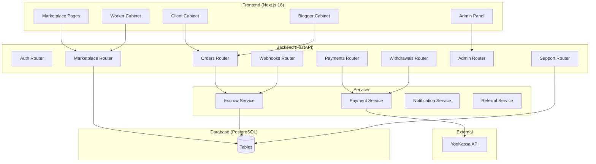
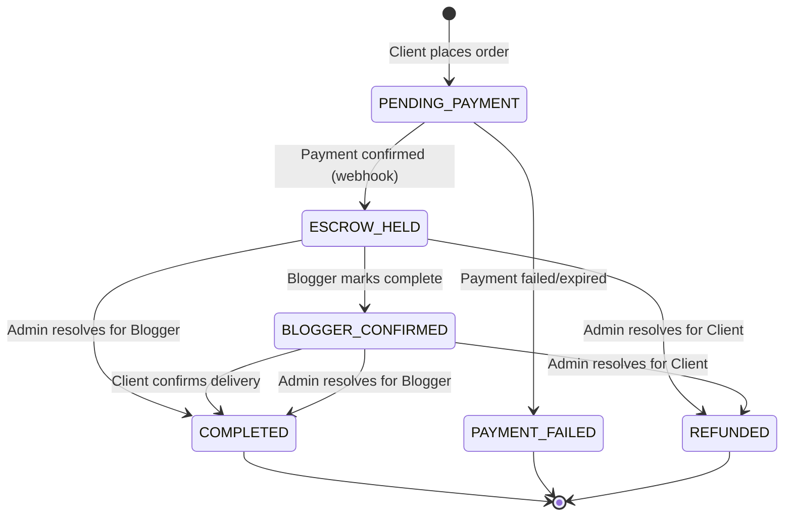
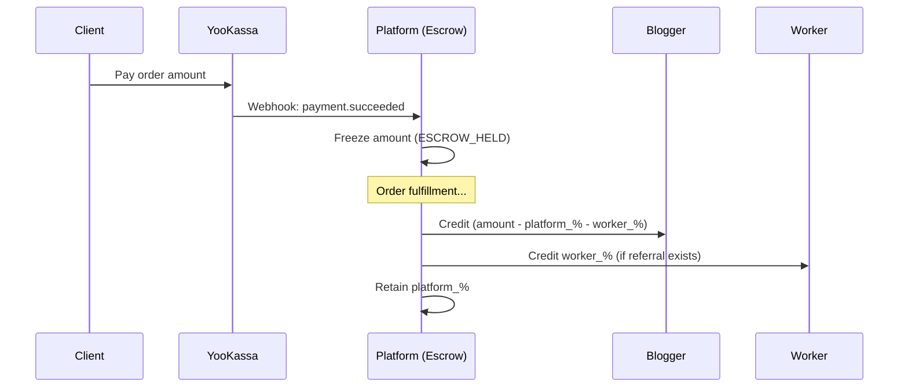

# Design Document: Blogger Marketplace

## Overview

Биржа блогеров — отдельный публичный маркетплейс, интегрированный в существующую платформу deltaproject. Система расширяет текущую архитектуру (FastAPI + Next.js + PostgreSQL) новой ролью `CLIENT`, набором таблиц для заказов/профилей/тикетов, эскроу-сервисом для безопасного распределения средств и интеграцией с YooKassa для приёма платежей и выплат.

**Ключевые решения:**
- Новая роль `CLIENT` добавляется в существующий enum `UserRole`
- Маркетплейс реализуется как отдельная группа страниц в Next.js (`/marketplace/*`)
- Эскроу реализуется через ledger-записи (двойная бухгалтерия) без отдельного банковского счёта
- YooKassa используется и для приёма платежей (Payment API), и для выплат (Payout API) — существующий клиент расширяется
- Комиссии фиксируются на момент создания заказа (snapshot)

## Architecture

### High-Level Architecture



### Order State Machine



### Fund Distribution Flow



## Components and Interfaces

### Backend Routers

#### 1. Marketplace Router (`routers/marketplace.py`)

Public endpoints (no auth required for catalog):

| Method | Path | Description |
|--------|------|-------------|
| GET | `/marketplace/bloggers` | Paginated catalog with filters |
| GET | `/marketplace/bloggers/{blogger_id}` | Full blogger profile |
| GET | `/marketplace/categories` | List of predefined categories |

#### 2. Orders Router (`routers/marketplace_orders.py`)

Authenticated endpoints (Client/Blogger roles):

| Method | Path | Description |
|--------|------|-------------|
| POST | `/marketplace/orders` | Create order (Client) |
| GET | `/marketplace/orders` | List my orders (Client/Blogger) |
| GET | `/marketplace/orders/{order_id}` | Order details |
| PATCH | `/marketplace/orders/{order_id}/complete` | Blogger marks complete |
| PATCH | `/marketplace/orders/{order_id}/confirm` | Client confirms delivery |

#### 3. Payments Router (`routers/marketplace_payments.py`)

| Method | Path | Description |
|--------|------|-------------|
| POST | `/marketplace/payments/{order_id}/create` | Create YooKassa payment |
| GET | `/marketplace/payments/{order_id}/status` | Check payment status |

#### 4. Withdrawals Router (`routers/marketplace_withdrawals.py`)

| Method | Path | Description |
|--------|------|-------------|
| POST | `/marketplace/withdrawals` | Request withdrawal (Blogger/Worker) |
| GET | `/marketplace/withdrawals` | List my withdrawals |
| GET | `/marketplace/withdrawals/{id}` | Withdrawal details |

#### 5. Support Router (`routers/marketplace_support.py`)

| Method | Path | Description |
|--------|------|-------------|
| POST | `/marketplace/support/tickets` | Create support ticket |
| GET | `/marketplace/support/tickets` | List my tickets |
| GET | `/marketplace/support/tickets/{id}` | Ticket details |

#### 6. Client Auth Router (`routers/marketplace_auth.py`)

| Method | Path | Description |
|--------|------|-------------|
| POST | `/marketplace/auth/register` | Client registration |
| POST | `/marketplace/auth/login` | Client login |
| POST | `/marketplace/auth/refresh` | Refresh tokens |

#### 7. Blogger Profile Router (`routers/marketplace_blogger_profile.py`)

| Method | Path | Description |
|--------|------|-------------|
| GET | `/marketplace/blogger/profile` | Get own profile |
| POST | `/marketplace/blogger/profile` | Create/complete profile |
| PATCH | `/marketplace/blogger/profile` | Update profile |

#### 8. Admin Marketplace Router (extends `routers/admin.py`)

| Method | Path | Description |
|--------|------|-------------|
| GET | `/admin/marketplace/dashboard` | Dashboard stats |
| GET | `/admin/marketplace/orders` | All orders with filters |
| PATCH | `/admin/marketplace/orders/{id}/resolve` | Resolve dispute |
| GET | `/admin/marketplace/settings` | Get commission settings |
| PUT | `/admin/marketplace/settings` | Update commission settings |
| GET | `/admin/marketplace/support/tickets` | All open tickets |
| PATCH | `/admin/marketplace/support/tickets/{id}/resolve` | Resolve ticket |
| PATCH | `/admin/marketplace/bloggers/{id}` | Edit blogger profile/status |

### Services

#### EscrowService (`services/marketplace_escrow_service.py`)

```python
class EscrowService:
    async def freeze_funds(order_id: UUID, amount_kopeks: int) -> None
    async def distribute_funds(order_id: UUID) -> DistributionResult
    async def refund_to_client(order_id: UUID) -> None
```

**Distribution logic:**
```
blogger_share = order_amount - platform_commission - worker_commission
worker_commission = order_amount * worker_referral_pct / 100  (0 if no referral)
platform_commission = order_amount * platform_pct / 100
```

All amounts in kopeks (integer arithmetic). Rounding: `floor()` for worker/platform, remainder to blogger.

#### PaymentService (`services/marketplace_payment_service.py`)

```python
class PaymentService:
    async def create_payment(order_id: UUID, amount_kopeks: int, 
                            return_url: str) -> PaymentResult
    async def handle_payment_webhook(event: dict) -> None
    async def create_payout(user_id: UUID, amount_kopeks: int,
                           payout_token: str) -> PayoutResult
    async def handle_payout_webhook(event: dict) -> None
```

Extends existing `yookassa_payout_client.py` pattern. Uses YooKassa Payment API v3 for incoming payments (new) and existing Payout API for outgoing payouts.

#### MarketplaceReferralService (`services/marketplace_referral_service.py`)

```python
class MarketplaceReferralService:
    def generate_referral_link(worker_id: UUID) -> str
    async def resolve_referral(ref_code: str) -> UUID | None
    async def get_referred_clients(worker_id: UUID, page: int) -> Page[ClientRef]
    async def get_commission_history(worker_id: UUID, page: int) -> Page[Commission]
```

## Data Models

### New Enums

```python
# enums/marketplace.py

class MarketplaceOrderStatus(str, enum.Enum):
    PENDING_PAYMENT = "PENDING_PAYMENT"
    PAYMENT_FAILED = "PAYMENT_FAILED"
    ESCROW_HELD = "ESCROW_HELD"
    BLOGGER_CONFIRMED = "BLOGGER_CONFIRMED"
    COMPLETED = "COMPLETED"
    REFUNDED = "REFUNDED"

class BloggerCategory(str, enum.Enum):
    LIFESTYLE = "lifestyle"
    TECH = "tech"
    BEAUTY = "beauty"
    FOOD = "food"
    TRAVEL = "travel"
    FITNESS = "fitness"
    GAMING = "gaming"
    EDUCATION = "education"
    BUSINESS = "business"
    ENTERTAINMENT = "entertainment"
    OTHER = "other"

class SupportTicketStatus(str, enum.Enum):
    OPEN = "open"
    RESOLVED = "resolved"

class WithdrawalStatus(str, enum.Enum):
    PENDING = "pending"
    COMPLETED = "completed"
    FAILED = "failed"
```

### Updated Enum

```python
# enums/user.py — add CLIENT role
class UserRole(str, enum.Enum):
    WORKER = "Worker"
    BLOGER = "Bloger"
    ADMIN = "Admin"
    TECH_ADMIN = "Tech_Admin"
    CLIENT = "Client"  # NEW
```

### New Tables

#### `blogger_profiles`

Marketplace profile for bloggers (one-to-one with `users` where role=Bloger).

```python
class BloggerProfile(Base):
    __tablename__ = "blogger_profiles"

    id: UUID = primary_key, default=uuid4
    user_id: UUID = FK("users.id"), unique, not null
    category: BloggerCategory = not null
    subscriber_count: int = not null  # 1..999_000_000
    average_price_kopeks: int = not null  # 100..1_000_000_00 (1 RUB..10M RUB)
    description: str(500) = not null
    portfolio_links: JSON = default []  # list[str], max 5
    social_links: JSON = not null  # list[str], min 1, max 10
    photo_url: str(2048) | None = nullable
    preferred_contact: str(100) | None = nullable
    is_active: bool = default True
    orders_enabled: bool = default True
    created_at: datetime = server_default now()
    updated_at: datetime = server_default now(), onupdate now()
```

**Indexes:** `idx_blogger_profiles_category`, `idx_blogger_profiles_subscriber_count`, `idx_blogger_profiles_average_price_kopeks`, `idx_blogger_profiles_is_active`

#### `marketplace_orders`

Orders placed by clients for blogger services.

```python
class MarketplaceOrder(Base):
    __tablename__ = "marketplace_orders"

    id: UUID = primary_key, default=uuid4
    client_id: UUID = FK("users.id"), not null, index
    blogger_id: UUID = FK("users.id"), not null, index
    worker_id: UUID | None = FK("users.id"), nullable, index  # referring worker
    status: MarketplaceOrderStatus = not null, default PENDING_PAYMENT
    amount_kopeks: int = not null  # order price at creation time
    message: str(1000) = not null  # client's message to blogger
    # Commission snapshot at order creation time
    platform_commission_pct: Decimal(5,2) = not null
    worker_commission_pct: Decimal(5,2) = not null, default 0
    # YooKassa payment
    yookassa_payment_id: str(80) | None = nullable
    payment_url: str(2048) | None = nullable
    payment_expires_at: datetime | None = nullable
    # Timestamps
    created_at: datetime = server_default now()
    paid_at: datetime | None = nullable
    completed_at: datetime | None = nullable
    updated_at: datetime = server_default now(), onupdate now()
```

**Indexes:** `idx_mkt_orders_status`, `idx_mkt_orders_created_at`, composite `idx_mkt_orders_client_status`

#### `marketplace_escrow_ledger`

Double-entry ledger for escrow operations (extends existing `ledger_entries` pattern).

```python
class MarketplaceEscrowEntry(Base):
    __tablename__ = "marketplace_escrow_ledger"

    id: UUID = primary_key, default=uuid4
    order_id: UUID = FK("marketplace_orders.id"), not null, index
    user_id: UUID = FK("users.id"), not null, index  # beneficiary
    entry_type: str(32) = not null  # "freeze", "release_blogger", "release_worker", "release_platform", "refund"
    amount_kopeks: int = not null  # positive = credit, negative = debit
    note: str(500) | None = nullable
    created_at: datetime = server_default now()
    idempotency_key: str(128) = unique, nullable
```

#### `marketplace_withdrawals`

Withdrawal requests from bloggers and workers.

```python
class MarketplaceWithdrawal(Base):
    __tablename__ = "marketplace_withdrawals"

    id: UUID = primary_key, default=uuid4
    user_id: UUID = FK("users.id"), not null, index
    amount_kopeks: int = not null  # requested amount
    status: WithdrawalStatus = not null, default PENDING
    yookassa_payout_id: str(80) | None = nullable
    error_message: str(500) | None = nullable
    created_at: datetime = server_default now()
    completed_at: datetime | None = nullable
    updated_at: datetime = server_default now(), onupdate now()
```

#### `support_tickets`

Support tickets for dispute resolution.

```python
class SupportTicket(Base):
    __tablename__ = "support_tickets"

    id: UUID = primary_key, default=uuid4
    order_id: UUID = FK("marketplace_orders.id"), not null, index
    submitter_id: UUID = FK("users.id"), not null, index
    submitter_role: UserRole = not null  # CLIENT or BLOGER
    message: str(2000) = not null
    status: SupportTicketStatus = not null, default OPEN
    # Resolution fields (filled when resolved)
    resolved_by: UUID | None = FK("users.id"), nullable
    resolution_decision: str(20) | None = nullable  # "favor_client" | "favor_blogger"
    resolution_reason: str(1000) | None = nullable
    resolved_at: datetime | None = nullable
    created_at: datetime = server_default now()
```

#### `marketplace_settings`

Platform-wide marketplace configuration (single row).

```python
class MarketplaceSettings(Base):
    __tablename__ = "marketplace_settings"

    id: int = primary_key, default=1  # singleton
    platform_commission_pct: Decimal(5,2) = not null, default 25.00
    worker_referral_commission_pct: Decimal(5,2) = not null, default 5.00
    updated_at: datetime = server_default now(), onupdate now()
    updated_by: UUID | None = FK("users.id"), nullable
```

#### `marketplace_referrals`

Worker referral codes for marketplace client acquisition.

```python
class MarketplaceReferral(Base):
    __tablename__ = "marketplace_referrals"

    id: UUID = primary_key, default=uuid4
    worker_id: UUID = FK("users.id"), unique, not null, index
    ref_code: str(64) = unique, not null, index  # short code for URL
    created_at: datetime = server_default now()
```

### Modified Tables

#### `users` table changes

- Add `CLIENT` to `user_role` PostgreSQL enum via Alembic migration
- Add column `marketplace_referred_by: UUID | None = FK("users.id")` — permanent worker association for clients
- Add column `marketplace_balance_kopeks: int = default 0` — marketplace earnings balance (separate from existing `balance` which is for deals)

### Database Migration Strategy

Alembic migration steps:
1. Add `CLIENT` value to `user_role` enum: `ALTER TYPE user_role ADD VALUE 'Client'`
2. Add `marketplace_referred_by` and `marketplace_balance_kopeks` columns to `users`
3. Create `marketplace_settings` table with default row
4. Create `blogger_profiles` table
5. Create `marketplace_orders` table
6. Create `marketplace_escrow_ledger` table
7. Create `marketplace_withdrawals` table
8. Create `support_tickets` table
9. Create `marketplace_referrals` table
10. Create indexes

## Correctness Properties

*A property is a characteristic or behavior that should hold true across all valid executions of a system — essentially, a formal statement about what the system should do. Properties serve as the bridge between human-readable specifications and machine-verifiable correctness guarantees.*

### Property 1: Catalog filtering returns only matching results

*For any* set of blogger profiles and any combination of filters (category, subscriber range, price range), all returned Blogger_Cards SHALL satisfy every active filter condition simultaneously (AND logic), and no card satisfying all conditions SHALL be excluded from results.

**Validates: Requirements 1.2, 1.3, 1.4, 1.5**

### Property 2: Catalog pagination invariants

*For any* set of blogger profiles, each page SHALL contain at most 20 items, items SHALL be sorted by profile creation date descending, and the union of all pages SHALL equal the complete filtered result set with no duplicates or omissions.

**Validates: Requirements 1.1**

### Property 3: Blogger card serialization completeness

*For any* blogger profile, the serialized Blogger_Card response SHALL contain all required fields (name, category, subscriber_count, average_price, photo_url or placeholder), and the full profile response SHALL additionally contain description, portfolio_links (if non-empty), and social_links (if non-empty).

**Validates: Requirements 1.7, 2.1, 2.2**

### Property 4: Profile validation round-trip

*For any* blogger profile input data, if all required fields satisfy their constraints (category from predefined list, subscriber_count 1..999M, price 1..10M RUB, description 1..500 chars, at least 1 social link), the profile SHALL be saved and the blogger card SHALL appear in the marketplace. For any input violating any constraint, the system SHALL reject with per-field errors and no profile SHALL be created.

**Validates: Requirements 3.2, 3.4, 3.5**

### Property 5: Client registration validation

*For any* registration input, if name is 1-255 chars, email is valid format up to 320 chars and not already taken, and password is 8-100 chars, the system SHALL create a Client account and return auth tokens. For any input violating any constraint, the system SHALL reject with specific per-field errors and no account SHALL be created.

**Validates: Requirements 5.2, 5.3, 5.5**

### Property 6: Referral association permanence

*For any* Client registered via a Worker referral link, the `marketplace_referred_by` association SHALL be set to the referring Worker's ID at registration time and SHALL never change regardless of subsequent operations (order placement, profile updates, or admin actions).

**Validates: Requirements 4.2**

### Property 7: Order creation validation

*For any* order creation request, if the message is 1-1000 characters and the target blogger is active with orders enabled, the system SHALL create an Order with status PENDING_PAYMENT. For any message that is empty or exceeds 1000 characters, the system SHALL reject and no Order SHALL be created.

**Validates: Requirements 6.2, 6.3**

### Property 8: Escrow fund distribution conservation

*For any* completed marketplace order with amount A, platform commission rate P%, and worker referral rate W% (0% if no referral), the distribution SHALL satisfy:
- `blogger_share + worker_share + platform_share == A` (conservation of funds)
- `platform_share == floor(A * P / 100)`
- `worker_share == floor(A * W / 100)` (0 if no referral)
- `blogger_share == A - platform_share - worker_share` (remainder to blogger)

All amounts are in kopeks (integer arithmetic, no floating point).

**Validates: Requirements 7.7, 7.8, 10.1, 10.2**

### Property 9: Commission configuration validation

*For any* commission value submitted by Admin (platform or worker referral), if the value is between 1 and 50 (platform) or 1 and 30 (worker) inclusive with at most 2 decimal places, the system SHALL persist the value. For any value outside the allowed range or with more than 2 decimal places, the system SHALL reject and retain the previous value.

**Validates: Requirements 8.2, 8.3, 8.5, 10.4, 10.5**

### Property 10: Commission temporal snapshot

*For any* marketplace order, the platform_commission_pct and worker_commission_pct applied to fund distribution SHALL equal the values that were active at the time of order creation, regardless of any subsequent changes to the global commission settings.

**Validates: Requirements 8.4**

### Property 11: Withdrawal validation and balance integrity

*For any* withdrawal request with amount X from a user with available balance B and linked card status C:
- If X >= 100 kopeks (1.00 RUB) AND X <= B AND X has at most 2 decimal places AND C is true, the system SHALL reduce balance by X and set withdrawal status to PENDING
- If any condition fails, the system SHALL reject, balance SHALL remain unchanged, and no payout SHALL be initiated

**Validates: Requirements 9.2, 9.3, 9.4, 9.5, 10.6, 10.7**

### Property 12: Withdrawal failure recovery

*For any* withdrawal in PENDING status, if YooKassa rejects the payout, the system SHALL restore the full withdrawal amount to the user's available balance and set status to FAILED. The balance after recovery SHALL equal the balance before the withdrawal request.

**Validates: Requirements 9.7**

### Property 13: Order state machine authorization

*For any* order status transition:
- Only the Blogger assigned to the order can transition from ESCROW_HELD to BLOGGER_CONFIRMED
- Only the Client who placed the order can transition from BLOGGER_CONFIRMED to COMPLETED
- Any other user attempting these transitions SHALL be rejected with an access error and the order status SHALL remain unchanged

**Validates: Requirements 7.2, 7.3, 7.5, 7.6**

### Property 14: Support ticket message validation

*For any* support ticket submission, if the message is 1-2000 non-whitespace-only characters and the order is in status ESCROW_HELD or BLOGGER_CONFIRMED, the system SHALL create a ticket. For any message that is empty, whitespace-only, or exceeds 2000 characters, the system SHALL reject without creating a ticket.

**Validates: Requirements 11.2, 11.3**

### Property 15: Admin dashboard aggregation correctness

*For any* set of marketplace orders, the admin dashboard SHALL display:
- Total orders count == count of all orders across all statuses
- Total revenue == sum of amount_kopeks for orders in statuses ESCROW_HELD, BLOGGER_CONFIRMED, and COMPLETED
- Active bloggers count == count of blogger_profiles where is_active=true
- Registered clients count == count of users where role=CLIENT

**Validates: Requirements 13.1**

## Error Handling

### Payment Errors

| Scenario | Handling |
|----------|----------|
| YooKassa payment creation fails | Order → PAYMENT_FAILED, return error to client |
| Payment webhook timeout (no webhook within 65 min) | Background job marks order PAYMENT_FAILED |
| Payment link expired | Webhook `payment.canceled` → PAYMENT_FAILED |
| Duplicate webhook | Idempotency key check, skip if already processed |

### Escrow Errors

| Scenario | Handling |
|----------|----------|
| Distribution calculation overflow | Use Python `int` (arbitrary precision), validate sum == original |
| Concurrent distribution attempt | DB transaction + `SELECT FOR UPDATE` on order row |
| Partial distribution failure | Full rollback, retry with exponential backoff |

### Withdrawal Errors

| Scenario | Handling |
|----------|----------|
| YooKassa payout rejected | Restore balance, set FAILED, log reason |
| Payout timeout (no webhook in 24h) | Background job checks status via API, resolves |
| Concurrent withdrawal race | `SELECT FOR UPDATE` on user balance, reject if insufficient |

### API Error Responses

Standard error format (consistent with existing project patterns):

```json
{
  "detail": "Human-readable error message"
}
```

Validation errors (422):
```json
{
  "detail": [
    {"loc": ["body", "field_name"], "msg": "error description", "type": "value_error"}
  ]
}
```

### Concurrency and Race Conditions

- **Double-payment prevention:** YooKassa payment_id stored on order; webhook handler checks order status before processing
- **Balance race conditions:** All balance modifications use `SELECT ... FOR UPDATE` within a transaction
- **Idempotent webhooks:** `idempotency_key` on escrow ledger entries prevents duplicate processing
- **Order state transitions:** Atomic `UPDATE ... WHERE status = expected_status` pattern

## Testing Strategy

### Property-Based Testing

**Library:** [Hypothesis](https://hypothesis.readthedocs.io/) (Python)

**Configuration:** Minimum 100 iterations per property test (`@settings(max_examples=100)`)

**Tag format:** `# Feature: blogger-marketplace, Property {N}: {title}`

Properties to implement as PBT:
- Property 1: Catalog filtering (generate random profiles + random filters)
- Property 2: Pagination invariants (generate random profile sets)
- Property 4: Profile validation (generate valid/invalid profile data)
- Property 5: Registration validation (generate valid/invalid registration data)
- Property 7: Order creation validation (generate valid/invalid messages)
- Property 8: Escrow fund distribution (generate random amounts + commission rates)
- Property 9: Commission validation (generate random decimal values)
- Property 10: Commission snapshot (generate orders + commission changes)
- Property 11: Withdrawal validation (generate amounts + balances + card states)
- Property 12: Withdrawal failure recovery (generate withdrawal amounts)
- Property 13: Order state machine authorization (generate users + orders)
- Property 14: Support ticket validation (generate messages of various lengths)
- Property 15: Dashboard aggregation (generate random order sets)

### Unit Tests (Example-Based)

- Client registration with duplicate email (edge case)
- Payment webhook handling (mock YooKassa responses)
- Blogger deactivation hides card but preserves orders
- Empty catalog state display
- Referral link with non-existent worker
- Admin manual order resolution

### Integration Tests

- YooKassa payment creation and webhook flow (mocked HTTP)
- YooKassa payout creation and webhook flow (mocked HTTP)
- Full order lifecycle: create → pay → confirm → distribute
- Full dispute lifecycle: create → support ticket → admin resolve → refund

### Frontend Tests

- Component rendering tests (React Testing Library)
- Form validation behavior
- Responsive layout checks (viewport 320px+)
- Loading/error state transitions

### Test File Structure

```
tests/
├── marketplace/
│   ├── test_catalog_properties.py      # PBT: Properties 1, 2, 3
│   ├── test_profile_properties.py      # PBT: Property 4
│   ├── test_registration_properties.py # PBT: Property 5
│   ├── test_order_properties.py        # PBT: Properties 7, 13
│   ├── test_escrow_properties.py       # PBT: Properties 8, 10
│   ├── test_commission_properties.py   # PBT: Property 9
│   ├── test_withdrawal_properties.py   # PBT: Properties 11, 12
│   ├── test_support_properties.py      # PBT: Property 14
│   ├── test_dashboard_properties.py    # PBT: Property 15
│   ├── test_payment_integration.py     # Integration: YooKassa flows
│   ├── test_order_lifecycle.py         # Integration: full order flow
│   └── test_edge_cases.py             # Unit: edge cases
```

### YooKassa Integration Details

**Payment Creation (new):**
- Endpoint: `POST https://api.yookassa.ru/v3/payments`
- Auth: Basic (shop_id:secret_key) — same credentials as existing payout
- Confirmation type: `redirect` (client redirected to YooKassa page)
- Metadata: `{"order_id": "<uuid>", "type": "marketplace"}`
- Expiration: `capture.expires_at` = now + 60 minutes

**Payment Webhooks:**
- `payment.succeeded` → freeze funds, update order to ESCROW_HELD
- `payment.canceled` → update order to PAYMENT_FAILED
- Webhook URL: existing `/webhooks/yookassa` endpoint, extended to handle payment events

**Payout (existing pattern extended):**
- Uses existing `yookassa_payout_client.py` for blogger/worker withdrawals
- Payout webhooks: `payout.succeeded` → COMPLETED, `payout.canceled` → FAILED + restore balance

### Frontend Architecture

**Marketplace SPA** (new route group in Next.js):

```
frontend/app/
├── (marketplace)/
│   ├── layout.tsx              # Marketplace shell (olive green theme)
│   ├── page.tsx                # Catalog page (/)
│   ├── bloggers/[id]/page.tsx  # Blogger profile
│   ├── orders/page.tsx         # Client orders list
│   ├── orders/[id]/page.tsx    # Order details
│   ├── cabinet/page.tsx        # Client cabinet
│   ├── auth/
│   │   ├── login/page.tsx
│   │   └── register/page.tsx
│   └── support/page.tsx        # Support tickets
├── (dashboard)/
│   ├── blogger/
│   │   ├── marketplace/page.tsx    # Blogger marketplace orders
│   │   └── profile/page.tsx        # Blogger profile management
│   └── worker/
│       └── marketplace/page.tsx    # Worker referral dashboard
```

**Shared state:** React Query (`@tanstack/react-query`) for server state (already in project).

**Design tokens:**
- Primary: `#6B8E23` (olive green)
- Border radius: `8px` minimum
- Box shadow: `0 2px 4px rgba(0,0,0,0.1)` to `0 4px 8px rgba(0,0,0,0.15)`
- Touch targets: minimum `44x44px`
