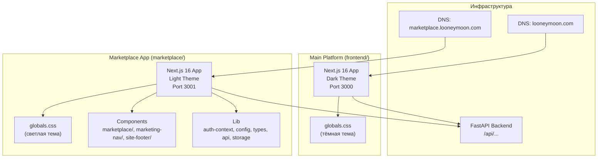

# Дизайн: Выделение маркетплейса в самостоятельное приложение

## Обзор

Данный дизайн описывает стратегию выделения маркетплейса из монолитного фронтенд-приложения `frontend/` в самостоятельное Next.js 16 приложение `marketplace/`. Ключевая идея — полная изоляция стилей, компонентов и утилит маркетплейса, с созданием независимой светлой дизайн-системы. Бэкенд остаётся без изменений — маркетплейс продолжает обращаться к тому же FastAPI API.

### Принятые решения

1. **Копирование vs. создание общего пакета**: Выбрано копирование shared-компонентов и lib-модулей в маркетплейс вместо создания общего npm-пакета. Причина — минимальная связность, простота деплоя, и отсутствие необходимости синхронизировать версии.
2. **Собственный globals.css**: Маркетплейс получает полностью автономный `globals.css` с токенами светлой темы. Это устраняет конфликты стилей навсегда.
3. **Навигационные ссылки**: Внутренние ссылки маркетплейса используют относительные пути. Ссылки на основную платформу используют абсолютный URL основного домена.

## Архитектура



### Структура файлов

```
deltaproject/
├── frontend/                      # Основная платформа (тёмная тема)
│   ├── app/
│   │   ├── globals.css            # НЕ ИЗМЕНЯЕТСЯ
│   │   ├── layout.tsx             # Удалить импорт RefTracker
│   │   └── (marketplace/ — УДАЛЕНА)
│   └── ...
├── marketplace/                   # Новое приложение маркетплейса
│   ├── app/
│   │   ├── globals.css            # Светлая тема — автономные токены
│   │   ├── layout.tsx             # Root layout + шрифты + providers
│   │   ├── page.tsx               # Каталог (бывший /marketplace)
│   │   ├── auth/
│   │   │   ├── login/page.tsx
│   │   │   └── register/page.tsx
│   │   ├── home/page.tsx
│   │   ├── orders/page.tsx
│   │   └── support/page.tsx
│   ├── components/
│   │   ├── marketplace/           # stitch-marketplace, shell, cards, etc.
│   │   ├── marketing-nav/         # Скопированный MarketingNav + CSS
│   │   ├── site-footer/           # Скопированный SiteFooter + CSS
│   │   └── providers/             # AppProviders (QueryClient + AuthProvider)
│   ├── lib/
│   │   ├── auth-context.tsx
│   │   ├── config.ts
│   │   ├── types.ts
│   │   ├── api.ts
│   │   ├── storage.ts
│   │   └── marketplace-categories.ts
│   ├── package.json
│   ├── next.config.ts
│   └── tsconfig.json
└── backend/                       # Без изменений
```

## Компоненты и интерфейсы

### 1. Marketplace Root Layout (`marketplace/app/layout.tsx`)

Корневой layout маркетплейса — загружает шрифты, подключает globals.css, оборачивает в providers.

```tsx
// marketplace/app/layout.tsx
import { Suspense } from "react";
import type { Metadata, ReactNode } from "react";
import { AppProviders } from "@/components/providers/app-providers";
import "./globals.css";

export const metadata: Metadata = {
  title: { default: "Каталог блогеров — Looney Moon", template: "%s · Looney Moon" },
  description: "Маркетплейс рекламных интеграций с блогерами",
};

export default function RootLayout({ children }: { children: ReactNode }) {
  return (
    <html lang="ru">
      <head>
        <link rel="preconnect" href="https://fonts.googleapis.com" />
        <link rel="preconnect" href="https://fonts.gstatic.com" crossOrigin="anonymous" />
        <link
          href="https://fonts.googleapis.com/css2?family=Cormorant+Garamond:ital,wght@0,400;0,500;0,600;1,400&family=EB+Garamond:ital,wght@0,400;0,500;0,600;1,400&family=Hanken+Grotesk:wght@300;400;500;600;700&family=Manrope:wght@300;400;500;600;700;800&display=swap"
          rel="stylesheet"
        />
      </head>
      <body>
        <AppProviders>{children}</AppProviders>
      </body>
    </html>
  );
}
```

### 2. Marketplace globals.css (светлая тема)

Полный набор CSS custom properties для светлой темы маркетплейса:

```css
:root {
  /* Surfaces — светлая тема */
  --bg: #faf9f7;
  --surface-base: #ffffff;
  --surface-raised: #f5f5f4;
  --surface-hover: #eeeeec;
  --surface-elev: #e8e8e6;
  --surface-inset: #f8f8f6;

  /* Borders */
  --border: rgba(0, 0, 0, 0.08);
  --border-strong: rgba(0, 0, 0, 0.16);
  --border-faint: rgba(0, 0, 0, 0.04);

  /* Text */
  --text-strong: #000000;
  --text: rgba(0, 0, 0, 0.87);
  --text-muted: rgba(0, 0, 0, 0.58);
  --text-soft: rgba(0, 0, 0, 0.36);
  --text-faint: rgba(0, 0, 0, 0.22);

  /* Status */
  --status-active: #000000;
  --status-success: #2e7d32;
  --status-warning: #f57c00;
  --status-danger: #c62828;

  /* Typography — те же шрифты */
  --font-display: "Manrope", system-ui, sans-serif;
  --font-body: "Manrope", system-ui, sans-serif;
  --font-narrow: "Hanken Grotesk", sans-serif;
  --font-serif: "Cormorant Garamond", Georgia, serif;
  --font-mono: monospace;

  /* Radii, spacing, transitions — идентичны */
  --radius-sm: 8px;
  --radius-md: 12px;
  --radius-lg: 18px;
  --radius-pill: 999px;
  --space-4: 1rem;
  --transition-base: 220ms cubic-bezier(.2,.6,.2,1);
  /* ... остальные токены */
}

html { color-scheme: light; }
body { background: var(--bg); color: var(--text-strong); }
```

### 3. Адаптация компонентов

**MarketingNav** — копируется в `marketplace/components/marketing-nav/`. Навигационные ссылки адаптируются:
- `href="/"` → каталог (внутри маркетплейса)
- Ссылка на личный кабинет → абсолютный URL `https://looneymoon.com/cabinet`

**SiteFooter** — копируется в `marketplace/components/site-footer/`. CSS адаптируется под светлую тему (фон, цвета текста уже управляются через токены).

**stitch-marketplace** — переносится как есть. Импорты обновляются с `@/components/marketing/marketing-nav` на `@/components/marketing-nav/marketing-nav`.

### 4. Конфигурация (`marketplace/next.config.ts`)

```typescript
import type { NextConfig } from "next";

const nextConfig: NextConfig = {
  // Разрешаем dev-запросы с поддоменов
  allowedDevOrigins: ["127.0.0.1", "localhost", "marketplace.localhost"],
};

export default nextConfig;
```

### 5. `marketplace/package.json`

```json
{
  "name": "marketplace",
  "version": "0.1.0",
  "private": true,
  "scripts": {
    "dev": "next dev --port 3001",
    "build": "next build",
    "start": "next start",
    "lint": "eslint ."
  },
  "dependencies": {
    "@tanstack/react-query": "^5.100.8",
    "framer-motion": "^12.39.0",
    "next": "^16.2.4",
    "react": "^19.2.5",
    "react-dom": "^19.2.5"
  },
  "devDependencies": {
    "@types/node": "^24.9.1",
    "@types/react": "^19.2.2",
    "@types/react-dom": "^19.2.2",
    "eslint": "^9.39.1",
    "eslint-config-next": "^16.2.4",
    "typescript": "^6.0.3"
  }
}
```

### 6. `marketplace/tsconfig.json`

```json
{
  "compilerOptions": {
    "target": "ES2017",
    "lib": ["dom", "dom.iterable", "esnext"],
    "allowJs": true,
    "skipLibCheck": true,
    "strict": true,
    "noEmit": true,
    "esModuleInterop": true,
    "module": "esnext",
    "moduleResolution": "bundler",
    "resolveJsonModule": true,
    "isolatedModules": true,
    "jsx": "preserve",
    "incremental": true,
    "plugins": [{ "name": "next" }],
    "paths": {
      "@/*": ["./*"]
    }
  },
  "include": ["next-env.d.ts", "**/*.ts", "**/*.tsx", ".next/types/**/*.ts"],
  "exclude": ["node_modules"]
}
```

## Модели данных

Модели данных маркетплейса — это подмножество типов из `frontend/lib/types.ts`. В маркетплейс переносятся только типы, используемые маркетплейсом:

```typescript
// marketplace/lib/types.ts — только нужные типы

export type BloggerProfile = {
  id: string;
  user_id: string;
  name: string;
  telegram_username?: string;
  profile_image_url?: string;
  category?: string;
  description?: string;
  audience_size?: number;
  price_per_post?: number;
  gender?: string;
};

export type AuthTokensResponse = {
  message: string;
  token: string;
  refresh_token: string;
};

// + UserMeRead, UserRole и другие типы, используемые в auth-context и api
```

**Принцип**: копируются только те типы, которые реально используются маркетплейсом. Типы admin-панели, финансовых схем и внутренних дашбордов НЕ переносятся.

### API-клиент маркетплейса

`marketplace/lib/api.ts` содержит урезанную версию API-клиента — только endpoints, используемые маркетплейсом:

- `GET /marketplace/bloggers` — каталог
- `GET /marketplace/categories` — категории
- `POST /marketplace/orders` — создание заказа
- `GET /marketplace/orders` — список заказов клиента
- `POST /auth/blogger-login` — вход блогера
- `POST /auth/refresh` — обновление токена
- `POST /auth/logout` — выход
- `GET /me` — текущий пользователь

## Обработка ошибок

1. **Сборка**: Если `marketplace/` содержит сломанный импорт из `frontend/`, `next build` упадёт с ошибкой "Module not found". Это сразу показывает нарушение изоляции.
2. **Стили**: CSS Modules гарантируют, что неопределённый токен не приведёт к runtime-ошибке — просто значение будет пустым. При разработке визуально заметно.
3. **API**: Маркетплейс использует тот же бэкенд. Если `NEXT_PUBLIC_API_BASE_URL` не указан — приложение не запустится (функция `required()` в `config.ts` бросит ошибку).
4. **Навигация**: Ссылки на основную платформу используют абсолютные URL. Если домен изменится — достаточно обновить env-переменную.

## Стратегия тестирования

### Подход

Данная фича — это структурная миграция (перенос файлов, копирование компонентов, создание конфигурации). Она НЕ содержит новой бизнес-логики или трансформаций данных. Основная проверка корректности:

1. **Build verification** — оба приложения успешно собираются (`next build`)
2. **Import isolation** — ни один файл в `marketplace/` не импортирует из `frontend/`
3. **Token completeness** — все CSS-токены, на которые ссылаются CSS Modules маркетплейса, определены в `marketplace/app/globals.css`
4. **No main platform modification** — `frontend/app/globals.css` не изменён (хэш-проверка)

### Почему НЕ используется Property-Based Testing

PBT не подходит для данной фичи, потому что:

- Это **структурная миграция**, а не реализация бизнес-логики
- Нет функций с входными/выходными данными, которые можно было бы проверять на случайных входах
- Корректность проверяется **сборкой** (`next build`) и **статическим анализом** (отсутствие cross-imports)
- Основные свойства — это **инвариант файловой структуры**, а не свойства данных

### Тесты (example-based)

1. **Smoke test**: `cd marketplace && npm run build` — успешная сборка подтверждает, что все импорты резолвятся, типы корректны, CSS Modules работают.
2. **Isolation check script**: grep-скрипт, проверяющий отсутствие `from "../../frontend/` или `from "@/../../frontend/` в файлах маркетплейса.
3. **Token coverage**: скрипт, извлекающий все `var(--token)` из CSS Modules маркетплейса и проверяющий их наличие в `marketplace/app/globals.css`.
4. **Main platform build**: `cd frontend && npm run build` — подтверждает, что удаление маркетплейс-роутов не сломало основную платформу.
