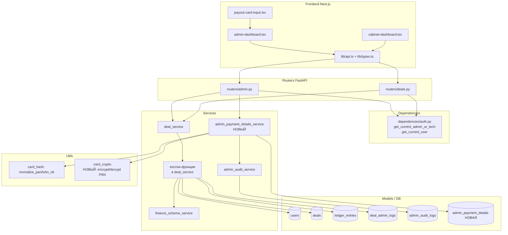
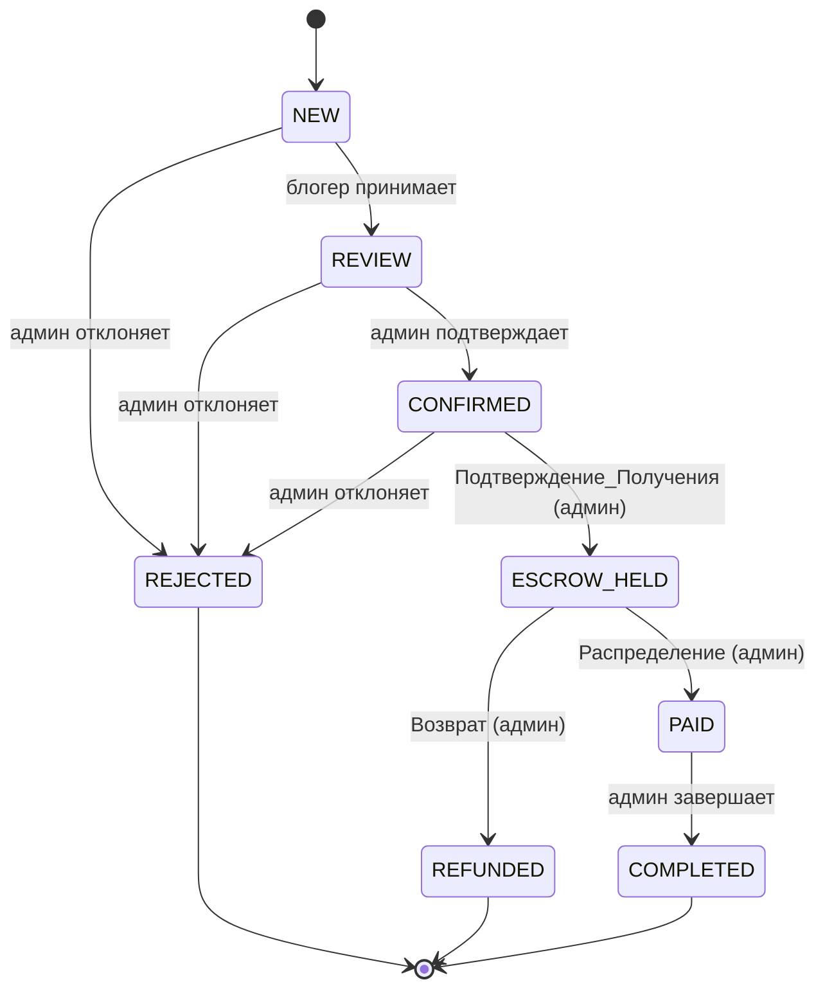
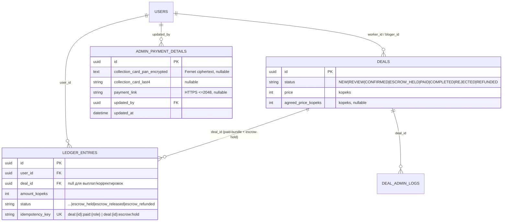

# Дизайн-документ

## Overview

Документ описывает техническое решение для функциональности «эскроу-платежи платформы» (FastAPI + async SQLAlchemy + Alembic + Pydantic v2 на бэкенде, Next.js + React Query + TypeScript на фронтенде). Все денежные суммы — целые числа в копейках.

Сейчас доли участникам зачисляются в момент перевода сделки в `PAID` без фактического поступления денег платформе (`admin_patch_deal_status` вызывает `_accrue_paid_deal` при пересечении границы `PAID` снизу по линейному порядку `_status_order`). Это и есть работа «на доверии». Новая модель вводит обязательный шлюз удержания средств: распределение долей невозможно, пока администратор вручную не подтвердит получение денег Плательщика.

Решение состоит из трёх блоков:

1. **Платёжные реквизиты администратора (приём средств).** Новая управляемая администратором запись с Картой_Приёма (полный PAN — для предъявления Плательщику, защищён шифрованием при хранении) и/или Платёжной_Ссылкой (HTTPS). Реквизиты предъявляются участникам сделки в статусе `CONFIRMED`.
2. **Эскроу-жизненный цикл сделки.** Два новых статуса (`ESCROW_HELD`, `REFUNDED`) и три административных действия: Подтверждение_Получения (`CONFIRMED → ESCROW_HELD`), Распределение (`ESCROW_HELD → PAID`), Возврат (`ESCROW_HELD → REFUNDED`). Начисление участникам происходит **только** на переходе `ESCROW_HELD → PAID`.
3. **Учётная запись Удержания_Эскроу.** Явная запись о собранных платформой средствах, удерживаемых до Распределения или Возврата, с жёсткой идемпотентностью на уровне БД.

### Ключевое архитектурное решение (анти-«доверие» шлюз)

Эскроу-модель обеспечивается **исключительно** машиной состояний сделки и правами, а не интеграцией с платёжным провайдером по входящим средствам. Подтверждение_Получения — это **ручное действие администратора**: оно фиксирует, что платформа получила деньги Плательщика по предъявленным реквизитам. Интеграция с ЮKassa остаётся **только для исходящих выплат** (`services/ledger_service.py::create_payout_request`, `services/yookassa_payout_client.py`) и в этом спеке не расширяется и не затрагивается. Распределение долей физически невозможно до перехода в `ESCROW_HELD`, что и закрывает работу «на доверии».

### Связь со спеком `admin-finance-management`

Этот спек опирается на уже реализованную инфраструктуру соседнего спека и не дублирует её:

| Используемый компонент (уже существует) | Назначение в этом спеке |
|---|---|
| Роль `UserRole.TECH_ADMIN` + зависимость `get_current_admin_or_tech` | Права на все новые админ-действия (приём реквизитов, эскроу-действия) |
| Таблица `admin_audit_logs` + `services/admin_audit_service.py::record_admin_audit` | Аудит изменений Карты_Приёма / Платёжной_Ссылки (маскированно) |
| `User.upline_blogger_id` + логика валидного аплайна в `_accrue_paid_deal` | Маршрутизация Реферальной_Доли при Распределении (без изменений) |
| `finance_scheme_service.distribute_price_kopeks` + ключи `deal:{id}:paid:{role}` | Расчёт и идемпотентное начисление долей при Распределении |
| `settings.platform_revenue_user_id` | Системный счёт платформы; владелец записи Удержания_Эскроу |

## Architecture

### Слои системы

Изменения вписываются в существующую слоистую архитектуру без её перестройки:



### Ключевые архитектурные решения

- **Начисление отвязано от пересечения границы `PAID`.** Вместо триггера «по линейному порядку при входе в `PAID`» начисление (`_accrue_paid_deal`) вызывается **только** дедикейтед-действием Распределения (`ESCROW_HELD → PAID`). Подтверждение_Получения (`CONFIRMED → ESCROW_HELD`) балансы не двигает.
- **Дедикейтед-эндпоинты для финансовых действий.** Подтверждение_Получения, Распределение и Возврат реализуются отдельными эндпоинтами (`/confirm-receipt`, `/distribute`, `/refund`), а не через общий `PATCH /admin/deals/{id}/status`. Общий эндпоинт смены статуса перестаёт принимать переходы в `ESCROW_HELD`/`PAID`/`REFUNDED` (они относятся к движению денег и требуют явной семантики и причины). Это делает аудит и права прозрачными и исключает случайное распределение через смену статуса.
- **Удержание_Эскроу — явная запись в `ledger_entries`.** Выбрана модель отдельной учётной записи (LedgerEntry на системном счёте платформы с ключом идемпотентности `deal:{id}:escrow:hold`), а не вывод «удержания» из статуса сделки. Обоснование — см. раздел Data Models → «Моделирование Удержания_Эскроу».
- **Полный PAN Карты_Приёма шифруется при хранении.** Сознательное расхождение с паттерном Карты_Выплаты (где хранится только хеш). Карту_Приёма нужно предъявлять Плательщику целиком, поэтому полный номер хранится в зашифрованном виде (authenticated encryption, ключ из настроек), а отдельно — `last4` для маскированного отображения и аудита.

### Машина состояний сделки (после изменений)



**Линейный порядок** (для `_status_order`): `NEW(0) < REVIEW(1) < CONFIRMED(2) < ESCROW_HELD(3) < PAID(4) < COMPLETED(5)`. `REJECTED` и `REFUNDED` — терминальные ветви вне линейного порядка (значение `-1`).

**Кто инициирует переходы:**

| Переход | Действие | Кто | Эндпоинт |
|---|---|---|---|
| `NEW → REVIEW` | принятие заявки | блогер сделки | `PATCH /deals/{id}` (без изменений) |
| `REVIEW → CONFIRMED` | подтверждение | `Admin`/`Tech_Admin` | `PATCH /admin/deals/{id}/status` |
| `NEW/REVIEW/CONFIRMED → REJECTED` | отклонение | `Admin`/`Tech_Admin` | `PATCH /admin/deals/{id}/status` |
| `CONFIRMED → ESCROW_HELD` | Подтверждение_Получения | `Admin`/`Tech_Admin` | `POST /admin/deals/{id}/confirm-receipt` |
| `ESCROW_HELD → PAID` | Распределение | `Admin`/`Tech_Admin` | `POST /admin/deals/{id}/distribute` |
| `ESCROW_HELD → REFUNDED` | Возврат | `Admin`/`Tech_Admin` | `POST /admin/deals/{id}/refund` |
| `PAID → COMPLETED` | завершение | `Admin`/`Tech_Admin` | `PATCH /admin/deals/{id}/status` |

## Components and Interfaces

### Блок A — Платёжные реквизиты администратора

#### Шифрование PAN при хранении (`utils/card_crypto.py`, НОВЫЙ)

```python
def encrypt_pan(pan_normalized: str, key: str) -> str: ...   # → ciphertext (str, для Text-колонки)
def decrypt_pan(ciphertext: str, key: str) -> str: ...       # → нормализованный PAN
```

- Симметричное **аутентифицированное** шифрование (рекомендуется `cryptography.fernet.Fernet`; ключ — URL-safe base64 32 байта из настроек). Fernet даёт конфиденциальность + целостность (HMAC) и встроенную метку версии ключа, что упрощает ротацию.
- Ключ берётся из `settings.collection_card_enc_key` (новая переменная окружения `COLLECTION_CARD_ENC_KEY`). Если ключ пуст — операции set/чтения полного PAN отдают `503` (паттерн как у `PAYOUT_CARD_PEPPER`).
- Полный PAN **никогда** не логируется и не попадает в аудит; в БД — только ciphertext + `last4`.

#### Сервис `services/admin_payment_details_service.py` (НОВЫЙ)

```python
async def set_admin_payment_details(
    actor: User,
    *,
    collection_card: str | None,
    payment_link: str | None,
    db: AsyncSession,
) -> AdminPaymentDetailsRead: ...

async def get_admin_payment_details_masked(db: AsyncSession) -> AdminPaymentDetailsRead: ...

async def get_active_payment_requisites_full(db: AsyncSession) -> PaymentRequisites | None: ...
```

Алгоритм `set_admin_payment_details` (атомарно, одна транзакция, `with_for_update` на singleton-строке):

1. **Нормализация входа.** `collection_card` и `payment_link` приводятся к `None`, если строка пуста/пробельна.
2. **Req 1.4 — хотя бы один реквизит.** Если оба `None` → `422`, прежние реквизиты не меняются.
3. **Валидация Карты_Приёма (если задана).** `pan = normalize_pan(card)` (реюз `utils/card_hash`); проверки: только цифры, длина 13–19, `luhn_ok(pan)`. Иначе `400`, прежняя карта без изменений (Req 2.2).
4. **Валидация Платёжной_Ссылки (если задана).** Абсолютный URL, схема `https`, длина ≤ 2048. Иначе `422`, прежняя ссылка без изменений (Req 2.3).
5. **Шифрование и сохранение.** Только после успешных проверок: `pan_encrypted = encrypt_pan(pan, key)`, `last4 = pan[-4:]`. Запись singleton-строки заменяется (Req 1.1, 1.2). Если реквизит передан как «очистить» (пустая строка) — соответствующее поле обнуляется (см. ниже про семантику замены).
6. **Аудит (Req 2.5, 2.6).** Для каждого изменённого реквизита — `record_admin_audit(actor_id=actor.id, target_user_id=settings.platform_revenue_user_id, field=..., old_value=..., new_value=...)`. Для карты `old_value`/`new_value` — **только `last4`** (никогда PAN). `target_user_id` = системный пользователь платформы (у реквизитов нет «целевого пользователя»; платформа — естественный владелец).
7. `commit`. Любая ошибка → полный `rollback`, исходные реквизиты сохраняются.

`get_admin_payment_details_masked` возвращает `payment_link` + `collection_card_last4` (Req 1.3) — **без** расшифровки PAN.

`get_active_payment_requisites_full` расшифровывает PAN и возвращает `PaymentRequisites { collection_card_full, payment_link, available }`; используется `deal_to_read` для авторизованных получателей по сделке в `CONFIRMED`. `available = (collection_card_full is not None) or (payment_link is not None)`.

> **Семантика замены (Req 1.2).** `PUT` заменяет запись целиком: явно переданный реквизит сохраняется, явно очищенный (пустая строка) — обнуляется, не переданный (`null`/отсутствует) — остаётся прежним. Это поведение фиксируется в схеме отдельным маркером «поле присутствует» (Pydantic `model_fields_set`), чтобы отличать «не трогать» от «очистить».

#### Эндпоинты (`routers/admin.py`), guard `get_current_admin_or_tech`

```
GET /admin/payment-details
  resp: AdminPaymentDetailsRead { payment_link: str|null, collection_card_last4: str|null, is_active: bool }
  (Req 1.3) — маскированно, без полного PAN

PUT /admin/payment-details
  body: AdminPaymentDetailsSet { collection_card: str|null, payment_link: str|null }
  resp: AdminPaymentDetailsRead
  (Req 1.1, 1.2, 1.4, 2.x) — set/replace + валидация + аудит
```

Неаутентифицированный или роль не `Admin`/`Tech_Admin` → `403` (Req 1.5) — обеспечивается зависимостью `get_current_admin_or_tech`.

#### Предъявление реквизитов по сделке (`deal_to_read`)

`deal_to_read` расширяется: для сделки в статусе `CONFIRMED` и при наличии Активного_Платёжного_Реквизита в ответ добавляется `payment_requisites: PaymentRequisites` с полным номером Карты_Приёма и/или Платёжной_Ссылкой — для работника сделки, блогера сделки и администратора (Req 3.1, 2.4). Если активных реквизитов нет — `payment_requisites = { available: false, ... }` (Req 3.2, без ошибки). Для статусов, отличных от `CONFIRMED`, поле `payment_requisites = None` (Req 3.3). Доступ к самой сделке уже ограничен `get_deal_for_user`/админ-зависимостью, поэтому посторонний получает `403` ещё до формирования ответа (Req 3.4).

### Блок B — Эскроу-функции (`services/deal_service.py`)

Новые функции в `deal_service.py` (раздел «Сервис_Эскроу»). Все блокируют строку сделки `SELECT ... FOR UPDATE`, как существующие админ-действия.

#### Идемпотентность Удержания_Эскроу — хелперы

```python
def _escrow_hold_key(deal_id: uuid.UUID) -> str:
    return f"deal:{deal_id}:escrow:hold"

async def _get_escrow_hold(deal_id: uuid.UUID, db: AsyncSession) -> LedgerEntry | None: ...
```

#### Подтверждение_Получения

```python
async def admin_confirm_receipt(deal_id, admin_user, reason, db) -> Deal:
```

1. Блокировка сделки. Валидация причины (1..1000, не пробелы) — на уровне схемы (Req 4.6).
2. **Идемпотентность (Req 4.7, 9.4).** Если запись Удержания_Эскроу по сделке уже существует (`_get_escrow_hold` вернул строку) → операция успешна, новое удержание не создаётся, статус и балансы без изменений.
3. Иначе: если `deal.status != CONFIRMED` → `409`, статус без изменений (Req 4.4).
4. Иначе: `deal.status = ESCROW_HELD`; создать запись Удержания_Эскроу: `LedgerEntry(user_id=platform, deal_id=deal.id, amount_kopeks=Base_Amount, status=escrow_held, idempotency_key="deal:{id}:escrow:hold", note=reason)`. **Балансы участников и платформы не меняются** (Req 4.2) — это учётная отметка, а не зачисление.
5. `DealAdminLog(action="receipt_confirm", old_status=CONFIRMED, new_status=ESCROW_HELD, admin_id, reason)` (Req 4.3, 8.6).
6. `commit`.

`Base_Amount = deal_distribution_amount_kopeks(deal)` (= `agreed_price_kopeks` иначе `price`). Согласованную цену задают только в `CONFIRMED` (`admin_set_agreed_price` уже это ограничивает), поэтому после перехода в `ESCROW_HELD` база фиксирована и совпадает с суммой удержания и будущим распределением.

#### Распределение

```python
async def admin_distribute_escrow(deal_id, admin_user, reason, db) -> Deal:
```

1. Блокировка сделки. Валидация причины.
2. **Идемпотентность (Req 5.6, 9.4).** Если по сделке уже есть полный набор начислений (`_paid_bundle_exists`) → операция успешна, балансы и записи журнала без изменений.
3. Иначе: если `deal.status != ESCROW_HELD` → `409`, статус и балансы без изменений (Req 6.3, 6.4). Это и есть запрет распределения без подтверждённого получения средств.
4. Иначе: проверка системного счёта платформы (Req 9.5) — внутри `_accrue_paid_deal`; при отсутствии → `500`, балансы без изменений. Затем `_accrue_paid_deal(deal, db)` — без изменений по логике, сохраняет ключи `deal:{id}:paid:{role}` (Req 5.1–5.5).
5. `deal.status = PAID`. Отметить Удержание_Эскроу как распределённое: `hold.status = escrow_released` (Req 5.7) — исключается из учёта удерживаемых нераспределённых средств.
6. `DealAdminLog(action="distribute", old_status=ESCROW_HELD, new_status=PAID, admin_id, reason)` (Req 8.6).
7. `commit`.

#### Возврат

```python
async def admin_refund_escrow(deal_id, admin_user, reason, db) -> Deal:
```

1. Блокировка сделки. Валидация причины.
2. **Идемпотентность (Req 9.4).** Если сделка уже `REFUNDED` и Удержание_Эскроу помечено возвращённым → операция успешна без изменений.
3. Иначе: если `deal.status != ESCROW_HELD` → `409`, статус без изменений (Req 7.4).
4. Иначе: `deal.status = REFUNDED`. Реверс/закрытие удержания: `hold.status = escrow_refunded` (Req 7.1, 7.7) — исключается из учёта удерживаемых средств. **Балансы работника, блогера, аплайна и платформы не меняются; начислений нет** (Req 7.2, 9.3).
5. `DealAdminLog(action="refund", old_status=ESCROW_HELD, new_status=REFUNDED, admin_id, reason)` (Req 8.6).
6. `commit`.

#### Обновление общей смены статуса (`admin_patch_deal_status`)

- **Удаляется** блок начисления по пересечению границы `PAID` (теперь начисление только в `admin_distribute_escrow`).
- `_status_order` обновляется (см. Data Models).
- Общий эндпоинт **отклоняет** (`409`) переходы в `ESCROW_HELD`, `PAID`, `REFUNDED` с сообщением «используйте действие приёма/распределения/возврата» — это финансовые действия с дедикейтед-эндпоинтами (Req 6.4: прямой `CONFIRMED → PAID` запрещён).
- `REFUNDED`, как и `REJECTED`, — терминальный: любой переход из `REFUNDED` отклоняется (Req 7.6).
- `REJECTED` допускается только из `NEW`/`REVIEW`/`CONFIRMED` (Req 8.2, 8.3) — существующая проверка сохраняется.
- `PAID → COMPLETED` разрешён (Req 6.5); `_apply_completed_stats` без изменений.

### Блок C — Frontend

Переиспользуются примитивы `components/common/ui.tsx` (`SectionCard`, `Field`, `TextInput`, `Button`, `Message`, `Modal`, `StatusPill`, `DataTable`, `CopyButton`) и стили `admin.module.css` / `cabinet.module.css`.

- **Типы (`lib/types.ts`).** Расширить `DealStatus`: `"ESCROW_HELD" | "REFUNDED"`. Добавить `PaymentRequisites`, `AdminPaymentDetails`, `AdminPaymentDetailsSet`; в `DealRead` — `payment_requisites: PaymentRequisites | null`.
- **API (`lib/api.ts`).** `getAdminPaymentDetails()`, `setAdminPaymentDetails({ collection_card, payment_link })`, `confirmDealReceipt(id, { reason })`, `distributeDeal(id, { reason })`, `refundDeal(id, { reason })`.
- **Админ — управление реквизитами.** В разделе «Финансы платформы» (секция `finance`, недавно перестроенная на `financeHero`/`metricGroups`) добавить карточку «Реквизиты приёма платежей» в стиле `metricGroup`: поле Платёжной_Ссылки и поле Карты_Приёма (переиспользовать `payout-card-input.tsx` для форматирования и Luhn-проверки 13–19 цифр), отображение `last4` и ссылки, кнопка сохранения. Согласованно с существующими `financeHero`/`metricGroups`.
- **Админ — эскроу-действия по сделке.** В карточке/модалке сделки кнопки «Подтвердить получение» (видна при `CONFIRMED`), «Распределить» (при `ESCROW_HELD`), «Возврат» (при `ESCROW_HELD`). Каждая открывает `Modal` с обязательным полем причины (`TextArea`, 1..1000). Добавить лейблы/`StatusPill` и фильтры статусов для `ESCROW_HELD`/`REFUNDED`.
- **Реквизиты по сделке (админ + кабинет).** В деталях сделки в статусе `CONFIRMED` показывать `payment_requisites` (полный номер Карты_Приёма и/или Платёжную_Ссылку) с `CopyButton` — чтобы работник/блогер передали их Плательщику. При `available=false` — подсказка «Реквизиты приёма не настроены». Кабинет (`cabinet-dashboard.tsx`) показывает реквизиты только для своих сделок в `CONFIRMED`.

## Data Models

### Изменение enum `deal_status` (Req 8.1)

Добавляются значения `ESCROW_HELD` и `REFUNDED` в нативный PG-enum `deal_status`. `ALTER TYPE ... ADD VALUE` **не может выполняться внутри транзакционного блока** в старых версиях PostgreSQL (≤ 11), поэтому миграция использует `op.get_context().autocommit_block()` — точно как существующие миграции `l6m7n8o9p0q1` (REJECTED) и `m7n8o9p0q1r2` (Tech_Admin).

```python
def upgrade() -> None:
    with op.get_context().autocommit_block():
        op.execute(sa.text("ALTER TYPE deal_status ADD VALUE IF NOT EXISTS 'ESCROW_HELD' BEFORE 'PAID'"))
        op.execute(sa.text("ALTER TYPE deal_status ADD VALUE IF NOT EXISTS 'REFUNDED'"))
```

`BEFORE 'PAID'` задаёт «красивый» порядок PG-enum (необязательно для корректности: линейный порядок переходов определяется в Python через `_status_order`, а не сортировкой PG). `downgrade` — документированный no-op (удаление значения enum в PG небезопасно при наличии зависимых строк), как в `m7n8o9p0q1r2`.

`enums/deal.py`:
```python
class DealStatus(str, enum.Enum):
    NEW = "NEW"
    REVIEW = "REVIEW"
    CONFIRMED = "CONFIRMED"
    ESCROW_HELD = "ESCROW_HELD"   # средства собраны и удерживаются платформой
    PAID = "PAID"                  # доли распределены участникам
    COMPLETED = "COMPLETED"
    REJECTED = "REJECTED"          # отклонена до сбора средств
    REFUNDED = "REFUNDED"          # собранные средства возвращены до распределения
```

`_status_order` (в `deal_service.py`):
```python
def _status_order(status_value: DealStatus) -> int:
    return {
        DealStatus.NEW: 0,
        DealStatus.REVIEW: 1,
        DealStatus.CONFIRMED: 2,
        DealStatus.ESCROW_HELD: 3,
        DealStatus.PAID: 4,
        DealStatus.COMPLETED: 5,
        DealStatus.REJECTED: -1,   # терминал
        DealStatus.REFUNDED: -1,   # терминал
    }[status_value]
```

### Изменение enum `ledger_entry_status`

Для записи Удержания_Эскроу добавляются три значения жизненного цикла удержания: `escrow_held` (активное удержание), `escrow_released` (распределено), `escrow_refunded` (возвращено). Миграция — `ALTER TYPE ledger_entry_status ADD VALUE` в `autocommit_block`. `enums/ledger.py`:

```python
class LedgerEntryStatus(str, enum.Enum):
    PAYOUT_REQUEST = "payout_request"
    FREEZE = "freeze"
    PENDING_CONFIRMATION = "pending_confirmation"
    COMPLETED = "completed"
    REJECTED = "rejected"
    ESCROW_HELD = "escrow_held"          # НОВОЕ
    ESCROW_RELEASED = "escrow_released"  # НОВОЕ
    ESCROW_REFUNDED = "escrow_refunded"  # НОВОЕ
```

### Моделирование Удержания_Эскроу (выбор подхода)

**Решение: явная запись `LedgerEntry` на системном счёте платформы** с ключом идемпотентности `deal:{id}:escrow:hold` и жизненным циклом статуса `escrow_held → escrow_released | escrow_refunded`.

| Критерий | Явная запись `LedgerEntry` (выбрано) | Деривация из статуса сделки (отклонено) | Новая таблица `escrow_holds` (отклонено) |
|---|---|---|---|
| Идемпотентность Req 4.7/9.4 | **Жёсткая, на уровне БД** (`unique idempotency_key`), как у paid-bundle | Мягкая (статус + блокировка строки) | Жёсткая (но дублирует инфраструктуру `ledger_entries`) |
| Учёт удерживаемых средств (Req 5.7/7.7) | Σ строк со статусом `escrow_held` — чистый запрос | Σ `base_amount` сделок в `ESCROW_HELD` — тоже чистый, но статус сделки перегружается денежным смыслом | Σ по новой таблице |
| Денежный аудит-трейл | Есть (история движения средств платформы) | Нет отдельной записи | Есть, но отдельно от журнала |
| Стоимость внедрения | +3 значения enum, реюз таблицы | Ноль новой инфраструктуры | +новая таблица, +модель, +миграция |

Обоснование выбора: требования прямо называют Удержание_Эскроу «учётной записью» (`учётная запись о средствах ... удерживаемых до распределения или Возврата`) и предписывают «отмечать как распределённое/возвращённое» с исключением из учёта удерживаемых средств — это подразумевает запрашиваемую запись с жизненным циклом. Явный `LedgerEntry` даёт жёсткую идемпотентность на уникальном `idempotency_key` (тот же механизм, что у `deal:{id}:paid:{role}`), запросный учёт удерживаемых средств и денежный аудит — при нулевой новой таблице.

**Важно: запись Удержания_Эскроу не меняет балансы.** Это бухгалтерская отметка (Req 4.2). Совместимость с дашбордом соседнего спека гарантирована тем, что строка имеет:
- статус `escrow_held`/`escrow_released`/`escrow_refunded` — не входит в фильтры дашборда (`freeze`/`pending_confirmation`/`payout_request` для «в ожидании»; `completed` для выплат/долей);
- `deal_id IS NOT NULL` — не попадает в выборку выплат (`deal_id IS NULL`);
- `idempotency_key = deal:{id}:escrow:hold` — не совпадает с шаблоном `deal:%:paid:%`.

Поэтому накопленная доля платформы, выплаты и «в ожидании» в дашборде не искажаются.

```
LedgerEntry (Удержание_Эскроу):
  user_id        = settings.platform_revenue_user_id
  deal_id        = deal.id
  amount_kopeks  = Base_Amount (снимок на момент Подтверждения_Получения)
  status         = escrow_held → escrow_released (распределено) | escrow_refunded (возвращено)
  idempotency_key= "deal:{id}:escrow:hold"   (unique → идемпотентность Req 4.7/9.4)
  note           = причина/контекст
```

### Новая таблица `admin_payment_details` (Блок A)

Singleton-таблица текущих реквизитов приёма (одна актуальная строка, заменяется при сохранении; история изменений — в `admin_audit_logs`).

```python
class AdminPaymentDetails(Base):
    __tablename__ = "admin_payment_details"

    id: Mapped[uuid.UUID]                          # PK, default uuid4
    collection_card_pan_encrypted: Mapped[str | None]  # Text, ciphertext полного PAN (Fernet); NULL если карта не задана
    collection_card_last4: Mapped[str | None]          # String(4), маскированное отображение/аудит
    payment_link: Mapped[str | None]                   # String(2048), абсолютный HTTPS URL
    updated_by: Mapped[uuid.UUID | None]               # FK users.id ON DELETE SET NULL — кто менял последним
    created_at: Mapped[datetime]                       # server_default now()
    updated_at: Mapped[datetime]                       # server_default now(), onupdate now()
```

- Полный PAN **только** в `collection_card_pan_encrypted` (зашифрован). В БД нет колонки с открытым PAN.
- Активность (Req: Активный_Платёжный_Реквизит) определяется на уровне сервиса: задан хотя бы один из `collection_card_pan_encrypted` / `payment_link`.
- Регистрация модели в `models/__init__.py`.

Миграция `create_table` — по образцу `o9p0q1r2s3t4_admin_audit_logs.py` (`op.create_table` + `ForeignKeyConstraint(updated_by → users.id, ondelete="SET NULL")`).

### Изменения схем (`schemas/`)

```python
# schemas/finance.py (или новый schemas/payment_details.py)
class AdminPaymentDetailsSet(BaseModel):
    collection_card: Annotated[str | None, Field(default=None, max_length=64)] = None
    payment_link: Annotated[str | None, Field(default=None, max_length=2048)] = None
    # точная валидация (Luhn 13–19, HTTPS) — в сервисе; «не передано vs очистить» — через model_fields_set

class AdminPaymentDetailsRead(BaseModel):
    payment_link: str | None = None
    collection_card_last4: str | None = None
    is_active: bool

class PaymentRequisites(BaseModel):
    collection_card_full: str | None = None   # полный PAN — только авторизованным по CONFIRMED-сделке
    payment_link: str | None = None
    available: bool

# schemas/deal.py
class AdminEscrowActionRequest(BaseModel):
    reason: Annotated[str, Field(min_length=1, max_length=1000)]

    @model_validator(mode="after")
    def _reason_not_blank(self):
        if not self.reason.strip():
            raise ValueError("Причина не может состоять из пробелов")
        return self

class DealRead(BaseModel):
    ...  # существующие поля
    payment_requisites: PaymentRequisites | None = None  # только в CONFIRMED для участников/админа
```

### Новый параметр настроек (`core/settings.py`)

```python
collection_card_enc_key: str = Field(
    default="",
    validation_alias="COLLECTION_CARD_ENC_KEY",
    description="Ключ (Fernet, base64 32 байта) для шифрования PAN Карты_Приёма при хранении; пусто — приём/чтение карты отключены (503)",
)
```

### Сводка моделей и схем

| Модель/схема | Изменение |
|---|---|
| `enums/deal.py::DealStatus` | + `ESCROW_HELD`, `REFUNDED` |
| `enums/ledger.py::LedgerEntryStatus` | + `ESCROW_HELD`, `ESCROW_RELEASED`, `ESCROW_REFUNDED` |
| `models/admin_payment_details.py::AdminPaymentDetails` | новая таблица |
| `models/__init__.py` | регистрация `AdminPaymentDetails` |
| `deal_service.py::_status_order` | + `ESCROW_HELD`, `PAID`/`COMPLETED` сдвиг, `REFUNDED` терминал |
| `deal_service.py` | + `admin_confirm_receipt`, `admin_distribute_escrow`, `admin_refund_escrow`, `_escrow_hold_key`, `_get_escrow_hold`; `admin_patch_deal_status` без блока начисления + запрет финансовых переходов; `deal_to_read` + `payment_requisites` |
| `utils/card_crypto.py` | новый: `encrypt_pan`/`decrypt_pan` |
| `services/admin_payment_details_service.py` | новый сервис |
| `core/settings.py` | + `collection_card_enc_key` |
| `schemas/deal.py` | + `AdminEscrowActionRequest`; `DealRead` + `payment_requisites` |
| `schemas/finance.py` (или `payment_details.py`) | + `AdminPaymentDetailsSet/Read`, `PaymentRequisites` |
| `routers/admin.py` | + `GET/PUT /admin/payment-details`; + `POST /admin/deals/{id}/confirm-receipt` `/distribute` `/refund` |
| `frontend/lib/types.ts` | `DealStatus` += `ESCROW_HELD`/`REFUNDED`; + `PaymentRequisites`/`AdminPaymentDetails*`; `DealRead.payment_requisites` |
| `frontend/lib/api.ts` | + методы реквизитов и эскроу-действий |
| `frontend/components/admin/admin-dashboard.tsx` | реквизиты приёма + эскроу-действия + статусы |
| `frontend/components/dashboard/cabinet-dashboard.tsx` | показ реквизитов по сделке в `CONFIRMED` + статусы |

### Диаграмма связей (фрагмент, после изменений)



## Correctness Properties

*Свойство (property) — это характеристика или поведение, которое должно выполняться для всех валидных исполнений системы; по сути, формальное утверждение о том, что система должна делать. Свойства служат мостом между человекочитаемой спецификацией и машинно-проверяемыми гарантиями корректности.*

Свойства ниже выведены из prework-анализа и прошли рефлексию на устранение избыточности (объединены: set/replace/read реквизитов; правило видимости полного PAN; идемпотентность трёх эскроу-действий; центральный инвариант «нет распределения без эскроу»). Граничные случаи (пустой запрос реквизитов, отсутствие реквизитов, пустые/слишком длинные причины, отсутствие системного счёта платформы) реализуются через генераторы внутри соответствующих property-тестов. Авторизация по ролям и UI-рендеринг проверяются примерными/интеграционными тестами (см. Testing Strategy).

### Property 1: Реквизиты приёма — round-trip set/replace/read и шифрование PAN без разглашения

*Для любого* набора валидных реквизитов (Карта_Приёма, прошедшая нормализацию/Luhn/длину 13–19, и/или абсолютная HTTPS-ссылка ≤ 2048): после сохранения маскированное чтение возвращает `payment_link`, равный заданной ссылке, и `collection_card_last4`, равный последним четырём цифрам карты, при этом расшифровка хранимого PAN возвращает исходный нормализованный номер, а маскированное чтение и хранимый ciphertext не содержат и не равны полному PAN; повторное сохранение другого валидного набора полностью заменяет ранее сохранённые значения.

**Validates: Requirements 1.1, 1.2, 1.3, 2.1**

### Property 2: Невалидный реквизит отвергается без изменения прежних

*Для любой* Карты_Приёма, не проходящей проверки (нецифровые символы после нормализации, длина вне 13–19, провал алгоритма Луна), или *любой* Платёжной_Ссылки, не являющейся абсолютным HTTPS-URL либо длиннее 2048 символов: сохранение отклоняется ошибкой валидации, а ранее сохранённые реквизиты остаются неизменными.

**Validates: Requirements 2.2, 2.3**

### Property 3: Полный номер Карты_Приёма виден только по правилу роли и статуса

*Для любого* зрителя и *любой* сделки полный номер Карты_Приёма присутствует в ответе на запрос сделки тогда и только тогда, когда зритель является `Admin`/`Tech_Admin` либо работником или блогером этой сделки, статус сделки равен `CONFIRMED`, и существует Активный_Платёжный_Реквизит с заданной картой; во всех остальных случаях (иной статус, отсутствие активных реквизитов, иной зритель) полный номер в ответе отсутствует.

**Validates: Requirements 2.4, 3.1, 3.3**

### Property 4: Аудит изменений реквизитов с маскированием карты

*Для любого* изменения Карты_Приёма или Платёжной_Ссылки администратором (`Admin` или `Tech_Admin`) создаётся запись аудита, содержащая идентификатор актора, наименование изменённого реквизита, прежнее значение, новое значение и отметку времени, причём для Карты_Приёма прежнее и новое значения представлены только маскированно (последние 4 цифры) и никогда не содержат полный PAN.

**Validates: Requirements 2.5, 2.6**

### Property 5: Подтверждение_Получения фиксирует удержание без движения балансов

*Для любой* сделки в статусе `CONFIRMED` Подтверждение_Получения переводит сделку в статус `ESCROW_HELD` и создаёт ровно одно Удержание_Эскроу на сумму, равную Базовой_Сумме сделки, при этом балансы работника, блогера, Аплайна и Платформы остаются неизменными.

**Validates: Requirements 4.1, 4.2**

### Property 6: Подтверждение_Получения отвергается вне статуса CONFIRMED

*Для любой* сделки в статусе, отличном от `CONFIRMED`, и не имеющей зафиксированного Удержания_Эскроу, Подтверждение_Получения отклоняется ошибкой, а статус сделки остаётся неизменным.

**Validates: Requirements 4.4**

### Property 7: Распределение — сохранение суммы и адресность начислений

*Для любой* сделки в статусе `ESCROW_HELD` Распределение переводит сделку в `PAID` и увеличивает баланс каждого участника ровно на его долю, рассчитанную Калькулятором_Распределения от Базовой_Суммы (Платформе — ровно долю платформы `pk`), так что сумма начислений работника, блогера, Аплайна и платформы равна Базовой_Сумме.

**Validates: Requirements 5.1, 5.2, 5.3**

### Property 8: Маршрутизация Реферальной_Доли при Распределении

*Для любой* сделки: если у её блогера `upline_blogger_id` указывает на существующего пользователя с ролью `Bloger`, отличного от самого блогера, то вся Реферальная_Доля `uk` зачисляется этому Аплайну, а блогер получает `bk` без `uk`; в противном случае (аплайн отсутствует, не-`Bloger` или совпадает с блогером) Реферальная_Доля прибавляется к доле блогера (`bk += uk`), а сумма начисления Аплайну равна нулю.

**Validates: Requirements 5.4, 5.5**

### Property 9: Распределение помечает Удержание_Эскроу распределённым

*Для любой* сделки, по которой выполнено Распределение, соответствующее Удержание_Эскроу отмечается как распределённое (`escrow_released`) и исключается из учёта удерживаемых нераспределённых средств.

**Validates: Requirements 5.7**

### Property 10: Невозможность Распределения без подтверждённого получения средств

*Для любой* сделки в статусе, отличном от `ESCROW_HELD` (в частности, `CONFIRMED`), Распределение (перевод в `PAID`) отклоняется ошибкой, статус сделки остаётся неизменным, и балансы всех участников остаются неизменными; перевод в `PAID` возможен исключительно из `ESCROW_HELD`.

**Validates: Requirements 6.2, 6.3, 6.4**

### Property 11: Допустимость переходов статусов

*Для любой* сделки переход в `ESCROW_HELD` допускается только из `CONFIRMED`, переход в `COMPLETED` — только из `PAID`, а перевод в `REJECTED` — только из `NEW`, `REVIEW` или `CONFIRMED`; любая попытка соответствующего перехода из иного исходного статуса отклоняется и не изменяет статус сделки.

**Validates: Requirements 6.1, 6.5, 8.2, 8.3**

### Property 12: Возврат реверсирует удержание без начислений

*Для любой* сделки в статусе `ESCROW_HELD` Возврат переводит сделку в `REFUNDED` и отмечает Удержание_Эскроу как возвращённое (`escrow_refunded`, исключается из учёта удерживаемых средств), при этом балансы работника, блогера, Аплайна и Платформы остаются неизменными, а суммарные начисления участникам по этой сделке равны нулю.

**Validates: Requirements 7.1, 7.2, 7.7, 9.3**

### Property 13: Возврат отвергается вне статуса ESCROW_HELD

*Для любой* сделки в статусе, отличном от `ESCROW_HELD`, Возврат отклоняется ошибкой, а статус сделки остаётся неизменным.

**Validates: Requirements 7.4**

### Property 14: REFUNDED — терминальный статус

*Для любой* сделки в статусе `REFUNDED` любой запрос на смену статуса (включая Подтверждение_Получения, Распределение, Возврат и общую смену статуса) отклоняется, а статус сделки остаётся `REFUNDED`.

**Validates: Requirements 7.6**

### Property 15: Идемпотентность Подтверждения_Получения, Распределения и Возврата

*Для любой* сделки и *любого* числа повторов: Подтверждение_Получения не создаёт более одного Удержания_Эскроу; Распределение не изменяет балансы участников и не создаёт дополнительных посделочных записей журнала после первого проведения; Возврат не реверсирует удержание повторно — так что итоговые начисления по последовательности Подтверждение→Распределение равны Базовой_Сумме и проводятся ровно один раз.

**Validates: Requirements 4.7, 5.6, 9.2, 9.4**

### Property 16: Калькулятор_Распределения — неотрицательность, целочисленность и сохранение суммы

*Для любой* неотрицательной Базовой_Суммы и любых неотрицательных весов схемы доли `(worker, bloger, upline, platform)`, возвращаемые `distribute_price_kopeks`, неотрицательны, целочисленны и в сумме равны Базовой_Сумме.

**Validates: Requirements 9.1**

### Property 17: Журналирование эскроу-действий

*Для любого* выполненного администратором действия из набора {Подтверждение_Получения, Распределение, Возврат} создаётся запись `DealAdminLog`, содержащая идентификатор администратора, прежний статус, новый статус и причину длиной 1–1000 символов.

**Validates: Requirements 4.3, 7.3, 8.6**

## Error Handling

### Общие принципы

- **HTTP-коды:** `400` — бизнес-валидация (например, карта вне 13–19/не Луна); `403` — недостаточно прав; `404` — ресурс не найден; `409` — конфликт состояния (недопустимый переход статуса/терминальный статус); `422` — ошибка валидации схемы Pydantic (пустой запрос реквизитов, невалидная ссылка/причина); `500` — несконфигурированный системный счёт платформы; `503` — отсутствует обязательный секрет (`COLLECTION_CARD_ENC_KEY`).
- **Атомарность:** эскроу-действия и сохранение реквизитов выполняются в одной транзакции; запись Удержания_Эскроу / начисления / `DealAdminLog` / аудит коммитятся вместе со сменой статуса. При любой ошибке — полный `rollback`, исходное состояние сохраняется.
- **Блокировки:** смена статуса сделки и эскроу-действия используют `SELECT ... FOR UPDATE` на строке сделки, как существующие `admin_patch_deal_status`/`admin_complete_payout`; сохранение реквизитов — `FOR UPDATE` на singleton-строке `admin_payment_details`.
- **Неразглашение PAN:** полный номер Карты_Приёма не логируется и не попадает в аудит ни при каких ошибках; в логах и `admin_audit_logs` — только `last4`.

### По требованиям

| Сценарий | Поведение | Req |
|---|---|---|
| Запрос реквизитов без карты и без ссылки | `422`, прежние реквизиты не меняются | 1.4 |
| Реквизиты: неаутентифицирован или роль не `Admin`/`Tech_Admin` | `403`, прежние реквизиты не меняются | 1.5 |
| Карта: нецифры/длина вне 13–19/провал Луна | `400`, прежняя карта не меняется | 2.2 |
| Ссылка: не HTTPS-абсолют или > 2048 | `422`, прежняя ссылка не меняется | 2.3 |
| Не задан `COLLECTION_CARD_ENC_KEY` при set/чтении полного PAN | `503`, данные карты не пишутся/не расшифровываются, ответ отличим от успеха | 2.1 (безопасность) |
| Сделка в `CONFIRMED` без активных реквизитов | `payment_requisites.available = false`, без ошибки | 3.2 |
| Реквизиты по сделке запрашивает посторонний | `403` (ограничение доступа к самой сделке) | 3.4 |
| Подтверждение_Получения вне `CONFIRMED` (без существующего удержания) | `409`, статус не меняется | 4.4 |
| Подтверждение/Распределение/Возврат не-админом | `403`, статус не меняется | 4.5, 7.5, 8.4 |
| Причина действия пустая/пробельная/> 1000 | `422`, статус не меняется | 4.6 |
| Повторное Подтверждение_Получения | Успех, единственное удержание, без дублей | 4.7, 9.4 |
| Распределение вне `ESCROW_HELD` (в т.ч. прямой `CONFIRMED → PAID`) | `409`, статус и балансы не меняются | 6.3, 6.4 |
| Прямой переход в `ESCROW_HELD`/`PAID`/`REFUNDED` через общий status-patch | `409` с указанием использовать дедикейтед-действие | 6.4 |
| Повторное Распределение | Успех, балансы и записи неизменны | 5.6, 9.4 |
| Возврат вне `ESCROW_HELD` | `409`, статус не меняется | 7.4 |
| Любая смена статуса сделки в `REFUNDED` | `409`, статус остаётся `REFUNDED` | 7.6 |
| Повторный Возврат | Успех, удержание не реверсируется повторно | 9.4 |
| Нет системного счёта платформы при Распределении | `500`, балансы участников не меняются, удержание остаётся `escrow_held` | 9.5 |

## Testing Strategy

### Подход

Двойное тестирование: **property-based тесты** проверяют универсальные инварианты эскроу-потока (сохранение суммы, идемпотентность, невозможность распределения без удержания, round-trip реквизитов и шифрования PAN); **примерные/интеграционные тесты** покрывают авторизацию по ролям, UI-рендеринг, конкретные граничные случаи и транзакционные откаты при сбоях.

PBT здесь уместен: ядро задач — детерминированная сервисная логика с явными инвариантами движения денег (`distribute_price_kopeks`, начисление/удержание/возврат по сделке, машина состояний, шифрование карты). Это не IaC и не чистый UI-рендеринг, поэтому свойства имеют смысл. UI-компоненты и интеграция с провайдером выплат (ЮKassa, исходящие) в этом спеке не покрываются property-тестами — для них примерные/интеграционные тесты.

### Библиотека и конфигурация PBT

- **Python (бэкенд):** [Hypothesis](https://hypothesis.readthedocs.io/) поверх `pytest`/`pytest-asyncio` — как в спеке `admin-finance-management`. Не реализовывать генерацию вручную.
- **Минимум 100 итераций на свойство:** `@settings(max_examples=100)` (или больше).
- **Тег каждого property-теста** комментарием со ссылкой на свойство дизайна в формате:
  `# Feature: platform-escrow-payments, Property {N}: {текст свойства}`
- Каждое свойство из раздела Correctness Properties реализуется **одним** property-тестом.
- Для сервисов с БД использовать транзакционную тестовую сессию (откат после каждого примера) либо in-memory модель/моки, чтобы 100+ итераций были дёшевы. Для чистых функций (`distribute_price_kopeks`, `card_crypto`) БД не нужна.

### Генераторы (стратегии Hypothesis)

- **Базовая сумма / цена:** `integers(min_value=1, max_value=10_000_000_000)` для `price` (схема требует `gt=0`); `agreed_price_kopeks` — `none() | integers(min_value=1, ...)`.
- **Веса схемы:** `integers(min_value=0, max_value=10_000)` (с отбрасыванием «все нули», где распределение возвращает нули).
- **Валидные PAN:** генерировать `n ∈ [13, 19]` цифр и дополнять контрольной цифрой по алгоритму Луна (как в `admin-finance-management`); невалидные — нарушать длину/контроль/символы.
- **Платёжные ссылки:** валидные — `https://` + случайный хост/путь длиной ≤ 2048; невалидные — `http://`, относительные, схемы не-HTTPS, строки > 2048.
- **Причины:** `text()` с управлением длиной (валидные 1–1000; невалидные — пробельные или > 1000).
- **Статусы сделки:** `sampled_from(DealStatus)` для проверки запретов переходов; для позитивных веток — фиксировать требуемый исходный статус и создавать сделку в нём (включая создание Удержания_Эскроу для веток распределения/возврата).
- **Аплайн:** генерировать конфигурации блогера (`upline_blogger_id` = none / валидный `Bloger` / не-`Bloger` / сам блогер) для маршрутизации Реферальной_Доли.
- **Зрители:** комбинации роли (`Worker`/`Bloger`/`Admin`/`Tech_Admin`) и участия в сделке (работник/блогер/посторонний) для свойства видимости полного PAN.
- **Число повторов действий:** `integers(min_value=1, max_value=5)` для свойств идемпотентности.

### Соответствие свойств тестам

Каждое из свойств 1–17 раздела Correctness Properties → один property-тест с тегом и `max_examples ≥ 100`. Ключевые семейства:
- Реквизиты приёма (Property 1, 2, 3, 4): round-trip set/replace/read, шифрование/неразглашение PAN, валидация, видимость по роли/статусу, аудит с маскированием.
- Эскроу-действия (Property 5–15): переходы, сохранение суммы, маршрутизация реф-доли, жизненный цикл удержания, идемпотентность, центральный инвариант «нет распределения без эскроу», терминальность `REFUNDED`.
- Калькулятор (Property 16) и журналирование (Property 17).

### Примерные и интеграционные тесты

- **Авторизация (роли):** реквизиты приёма (`GET`/`PUT`) и три эскроу-действия — `worker`/`bloger`/анонимный → `403` без изменения состояния; `admin`/`tech_admin` → успех (Req 1.5, 4.5, 7.5, 8.4, 8.5).
- **Граничные случаи как примеры:** пустой запрос реквизитов → `422` (Req 1.4); `CONFIRMED` без активных реквизитов → `available=false` (Req 3.2); посторонний по сделке → `403` (Req 3.4); пустая/длинная причина → `422` (Req 4.6); отсутствие системного счёта платформы при Распределении → `500`, балансы неизменны (Req 9.5); отсутствие `COLLECTION_CARD_ENC_KEY` → `503`.
- **Наличие enum-значений (smoke):** `DealStatus` содержит `ESCROW_HELD`/`REFUNDED`, миграция применяется к БД, существующие сделки в `PAID`/`COMPLETED` не затронуты (Req 8.1).
- **Обратная совместимость:** существующие посделочные начисления (`deal:{id}:paid:{role}`) и их идемпотентность сохраняются; запись Удержания_Эскроу (`escrow_*`, `deal_id` непустой) не попадает в выборки финансового дашборда соседнего спека.
- **UI (React, Testing Library):** карточка управления реквизитами приёма (сохранение, отображение `last4`/ссылки), кнопки эскроу-действий с модалкой причины и их видимость по статусу, отображение `payment_requisites` по сделке в `CONFIRMED` с `CopyButton`, статусы `ESCROW_HELD`/`REFUNDED` в списках и фильтрах.
- **Транзакционные откаты:** сбой записи `DealAdminLog`/Удержания_Эскроу/начисления → полный `rollback`, статус и балансы исходные.

### Замечание по миграциям (тестовое окружение)

`ALTER TYPE ... ADD VALUE` в `autocommit_block` не откатывается транзакцией теста. Тесты, зависящие от новых значений enum (`deal_status`, `ledger_entry_status`), исполняются на БД с уже применёнными миграциями (как существующие тесты с `Tech_Admin`/`REJECTED`); чистые property-тесты калькулятора и шифрования от БД не зависят.
