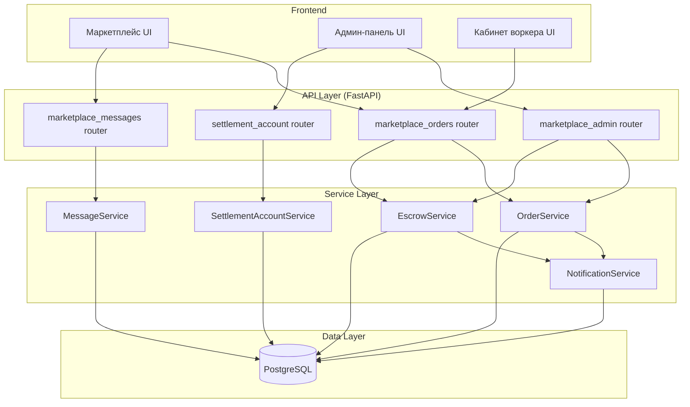
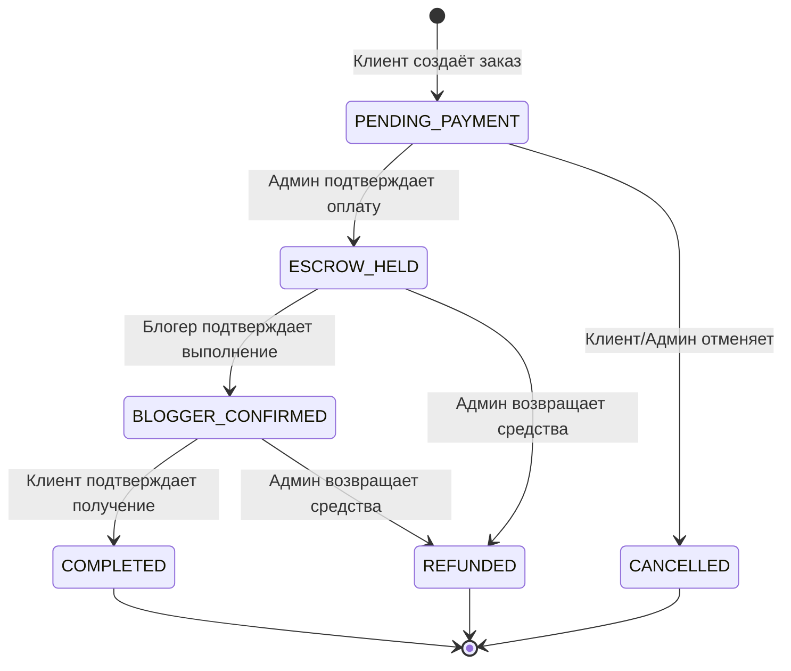

# Технический дизайн: Заказы через реферал воркера

## Overview

Данный дизайн описывает архитектуру подсистемы «Заказы через реферал воркера» — расширения маркетплейса блогеров. Система реализует полный жизненный цикл заказа: от создания заказчиком (приведённым воркером) через оплату на расчётный счёт, двустороннее подтверждение выполнения до автоматического распределения средств между участниками (блогер, воркер, платформа).

### Ключевые решения

- **Оплата на расчётный счёт**: вместо автоматического захвата через ЮKassa, администратор вручную подтверждает получение перевода — это упрощает интеграцию и позволяет работать с любыми банками.
- **Пожизненная привязка**: поле `marketplace_referred_by` в модели `User` — неизменяемое после установки.
- **Снапшот комиссий**: значения комиссий фиксируются в заказе на момент создания, что защищает от ретроактивных изменений.
- **Идемпотентность**: все финансовые операции (freeze, distribute, refund) используют `idempotency_key`.
- **Целочисленная арифметика**: все суммы в копейках, распределение через floor + остаток блогеру.

## Architecture

### Общая диаграмма



### Диаграмма состояний заказа



### Допустимые переходы статусов

| Из статуса | В статус | Кто инициирует |
|---|---|---|
| `PENDING_PAYMENT` | `ESCROW_HELD` | Admin |
| `PENDING_PAYMENT` | `CANCELLED` | Client / Admin |
| `ESCROW_HELD` | `BLOGGER_CONFIRMED` | Blogger |
| `ESCROW_HELD` | `REFUNDED` | Admin |
| `BLOGGER_CONFIRMED` | `COMPLETED` | Client |
| `BLOGGER_CONFIRMED` | `REFUNDED` | Admin |

## Components and Interfaces

### 1. SettlementAccountService

Управление реквизитами расчётного счёта (singleton-запись в БД).

```python
# services/settlement_account_service.py

async def get_settlement_account(db: AsyncSession) -> SettlementAccount | None:
    """Получить текущие реквизиты р/с. None если не настроены."""

async def upsert_settlement_account(
    db: AsyncSession,
    data: SettlementAccountUpsert,
    admin_id: uuid.UUID,
) -> SettlementAccount:
    """Создать/обновить реквизиты. Валидирует формат полей."""
```

### 2. OrderService (расширение существующего)

Расширяет `marketplace_orders` router новыми эндпоинтами.

```python
# routers/marketplace_orders.py — новые/изменённые эндпоинты

# POST /marketplace/orders — уже существует, дополнить amount_kopeks из тела
# GET  /marketplace/orders/{id} — дополнить settlement_account в ответе
# PATCH /marketplace/orders/{id}/complete — уже существует (blogger confirms)
# PATCH /marketplace/orders/{id}/confirm — уже существует (client confirms)
# PATCH /marketplace/orders/{id}/cancel — новый (client cancels)

# routers/marketplace_admin.py — новые эндпоинты
# PATCH /admin/marketplace/orders/{id}/confirm-payment — админ подтверждает оплату
# PATCH /admin/marketplace/orders/{id}/refund — админ оформляет возврат
# GET   /admin/marketplace/orders — список с фильтрами
# GET   /admin/marketplace/orders/{id} — детали
# GET   /admin/marketplace/summary — сводка
```

### 3. MessageService

Новый сервис для переписки между заказчиком и блогером.

```python
# services/marketplace_message_service.py

async def send_message(
    db: AsyncSession,
    sender_id: uuid.UUID,
    recipient_id: uuid.UUID,
    text: str,
) -> MarketplaceMessage:
    """Отправить сообщение. Валидирует текст (1-2000 символов, не пробелы)."""

async def get_conversation(
    db: AsyncSession,
    user_id: uuid.UUID,
    partner_id: uuid.UUID,
    page: int = 1,
    page_size: int = 50,
) -> tuple[list[MarketplaceMessage], int]:
    """Получить переписку с пагинацией в хронологическом порядке."""
```

### 4. NotificationService

Новый сервис in-app уведомлений.

```python
# services/notification_service.py

async def notify(
    db: AsyncSession,
    user_id: uuid.UUID,
    event_type: str,
    payload: dict,
) -> Notification:
    """Создать in-app уведомление для пользователя."""

async def get_notifications(
    db: AsyncSession,
    user_id: uuid.UUID,
    page: int = 1,
    page_size: int = 50,
    unread_only: bool = False,
) -> tuple[list[Notification], int]:
    """Список уведомлений с пагинацией."""

async def mark_as_read(
    db: AsyncSession,
    user_id: uuid.UUID,
    notification_ids: list[uuid.UUID],
) -> None:
    """Отметить уведомления как прочитанные."""
```

### 5. EscrowService (расширение существующего)

Существующий `marketplace_escrow_service.py` уже реализует `freeze_funds`, `distribute_funds`, `refund_to_client`. Необходимые изменения:

- `confirm_payment` — новая функция: переводит заказ в `ESCROW_HELD` + вызывает `freeze_funds`
- `process_refund` — новая функция с причиной возврата и логированием в журнал
- `distribute_funds` — без изменений, уже работает корректно

```python
# services/marketplace_escrow_service.py — новые функции

async def confirm_payment(
    order_id: uuid.UUID,
    admin_id: uuid.UUID,
    db: AsyncSession,
) -> MarketplaceOrder:
    """Админ подтверждает оплату: PENDING_PAYMENT → ESCROW_HELD + freeze."""

async def process_refund(
    order_id: uuid.UUID,
    admin_id: uuid.UUID,
    reason: str,
    db: AsyncSession,
) -> MarketplaceOrder:
    """Админ оформляет возврат: ESCROW_HELD/BLOGGER_CONFIRMED → REFUNDED."""
```

### 6. WorkerDashboardService

Новый сервис для кабинета воркера на маркетплейсе.

```python
# services/worker_dashboard_service.py

async def get_referrals(
    db: AsyncSession,
    worker_id: uuid.UUID,
    page: int = 1,
    page_size: int = 50,
) -> tuple[list[ReferralInfo], int]:
    """Список приведённых заказчиков."""

async def get_commission_history(
    db: AsyncSession,
    worker_id: uuid.UUID,
    page: int = 1,
    page_size: int = 50,
) -> tuple[list[CommissionEntry], int]:
    """История начислений комиссий."""

async def get_stats(
    db: AsyncSession,
    worker_id: uuid.UUID,
) -> WorkerMarketplaceStats:
    """Сводка: общая сумма комиссий, баланс."""
```

### API Endpoints (полный перечень)

| Метод | Путь | Роль | Описание |
|---|---|---|---|
| GET | `/admin/settlement-account` | Admin | Получить реквизиты р/с |
| PUT | `/admin/settlement-account` | Admin | Сохранить реквизиты р/с |
| GET | `/admin/marketplace/commission-settings` | Admin | Получить комиссии |
| PUT | `/admin/marketplace/commission-settings` | Admin | Обновить комиссии |
| PATCH | `/admin/marketplace/orders/{id}/confirm-payment` | Admin | Подтвердить оплату |
| PATCH | `/admin/marketplace/orders/{id}/refund` | Admin | Возврат средств |
| GET | `/admin/marketplace/orders` | Admin | Список заказов (фильтры) |
| GET | `/admin/marketplace/orders/{id}` | Admin | Детали заказа |
| GET | `/admin/marketplace/summary` | Admin | Сводка по заказам |
| POST | `/marketplace/orders` | Client | Создать заказ |
| GET | `/marketplace/orders` | Client/Blogger | Мои заказы |
| GET | `/marketplace/orders/{id}` | Client/Blogger/Admin | Детали заказа |
| PATCH | `/marketplace/orders/{id}/complete` | Blogger | Подтвердить выполнение |
| PATCH | `/marketplace/orders/{id}/confirm` | Client | Подтвердить получение |
| PATCH | `/marketplace/orders/{id}/cancel` | Client | Отменить заказ |
| POST | `/marketplace/messages` | Client/Blogger | Отправить сообщение |
| GET | `/marketplace/messages/{partner_id}` | Client/Blogger | История переписки |
| GET | `/marketplace/notifications` | All | Список уведомлений |
| PATCH | `/marketplace/notifications/read` | All | Отметить прочитанными |
| GET | `/marketplace/worker/referrals` | Worker | Мои рефералы |
| GET | `/marketplace/worker/commissions` | Worker | История комиссий |
| GET | `/marketplace/worker/stats` | Worker | Статистика |

## Data Models

### Новые модели

#### 1. SettlementAccount (Расчётный счёт)

```python
# models/settlement_account.py
class SettlementAccount(Base):
    __tablename__ = "settlement_accounts"

    id: Mapped[int] = mapped_column(Integer, primary_key=True)  # singleton, id=1
    account_number: Mapped[str] = mapped_column(String(20), nullable=False)  # ровно 20 цифр
    bic: Mapped[str] = mapped_column(String(9), nullable=False)  # ровно 9 цифр
    bank_name: Mapped[str] = mapped_column(String(255), nullable=False)
    recipient_name: Mapped[str] = mapped_column(String(255), nullable=False)
    updated_by: Mapped[uuid.UUID | None] = mapped_column(
        UUID(as_uuid=True), ForeignKey("users.id"), nullable=True
    )
    updated_at: Mapped[datetime] = mapped_column(
        DateTime(timezone=True), server_default=func.now(), onupdate=func.now()
    )
```

#### 2. MarketplaceMessage (Сообщение)

```python
# models/marketplace_message.py
class MarketplaceMessage(Base):
    __tablename__ = "marketplace_messages"
    __table_args__ = (
        Index("ix_mkt_msg_conversation", "sender_id", "recipient_id"),
        Index("ix_mkt_msg_created_at", "created_at"),
    )

    id: Mapped[uuid.UUID] = mapped_column(UUID(as_uuid=True), primary_key=True, default=uuid.uuid4)
    sender_id: Mapped[uuid.UUID] = mapped_column(UUID(as_uuid=True), ForeignKey("users.id"), nullable=False)
    recipient_id: Mapped[uuid.UUID] = mapped_column(UUID(as_uuid=True), ForeignKey("users.id"), nullable=False)
    text: Mapped[str] = mapped_column(String(2000), nullable=False)
    created_at: Mapped[datetime] = mapped_column(
        DateTime(timezone=True), server_default=func.now(), nullable=False
    )
```

#### 3. Notification (Уведомление)

```python
# models/notification.py
class Notification(Base):
    __tablename__ = "notifications"
    __table_args__ = (
        Index("ix_notifications_user_unread", "user_id", "is_read"),
        Index("ix_notifications_created_at", "created_at"),
    )

    id: Mapped[uuid.UUID] = mapped_column(UUID(as_uuid=True), primary_key=True, default=uuid.uuid4)
    user_id: Mapped[uuid.UUID] = mapped_column(UUID(as_uuid=True), ForeignKey("users.id"), nullable=False)
    event_type: Mapped[str] = mapped_column(String(50), nullable=False)
    payload: Mapped[dict] = mapped_column(JSONB, nullable=False, default=dict)
    is_read: Mapped[bool] = mapped_column(Boolean, nullable=False, default=False, server_default=text("false"))
    created_at: Mapped[datetime] = mapped_column(
        DateTime(timezone=True), server_default=func.now(), nullable=False
    )
```

#### 4. OrderStatusHistory (История статусов заказа)

```python
# models/order_status_history.py
class OrderStatusHistory(Base):
    __tablename__ = "order_status_history"
    __table_args__ = (
        Index("ix_osh_order_id", "order_id"),
    )

    id: Mapped[uuid.UUID] = mapped_column(UUID(as_uuid=True), primary_key=True, default=uuid.uuid4)
    order_id: Mapped[uuid.UUID] = mapped_column(
        UUID(as_uuid=True), ForeignKey("marketplace_orders.id"), nullable=False
    )
    old_status: Mapped[str | None] = mapped_column(String(30), nullable=True)
    new_status: Mapped[str] = mapped_column(String(30), nullable=False)
    changed_by: Mapped[uuid.UUID] = mapped_column(UUID(as_uuid=True), ForeignKey("users.id"), nullable=False)
    reason: Mapped[str | None] = mapped_column(String(1000), nullable=True)
    created_at: Mapped[datetime] = mapped_column(
        DateTime(timezone=True), server_default=func.now(), nullable=False
    )
```

### Изменения существующих моделей

#### MarketplaceOrder — добавить поля

```python
# Новые поля в models/marketplace_order.py
    # Refund tracking
    refunded_at: Mapped[datetime | None] = mapped_column(DateTime(timezone=True), nullable=True)
    refund_reason: Mapped[str | None] = mapped_column(String(1000), nullable=True)
    refunded_by: Mapped[uuid.UUID | None] = mapped_column(
        UUID(as_uuid=True), ForeignKey("users.id"), nullable=True
    )
    # Payment confirmation tracking  
    confirmed_by: Mapped[uuid.UUID | None] = mapped_column(
        UUID(as_uuid=True), ForeignKey("users.id"), nullable=True
    )
    # Blogger confirmation timestamp
    blogger_confirmed_at: Mapped[datetime | None] = mapped_column(DateTime(timezone=True), nullable=True)
```

#### MarketplaceOrderStatus enum — добавить `CANCELLED`

```python
# enums/marketplace.py
class MarketplaceOrderStatus(str, enum.Enum):
    PENDING_PAYMENT = "PENDING_PAYMENT"
    PAYMENT_FAILED = "PAYMENT_FAILED"
    ESCROW_HELD = "ESCROW_HELD"
    BLOGGER_CONFIRMED = "BLOGGER_CONFIRMED"
    COMPLETED = "COMPLETED"
    REFUNDED = "REFUNDED"
    CANCELLED = "CANCELLED"  # новый статус
```

### Pydantic-схемы (ключевые)

```python
# schemas/settlement_account.py
class SettlementAccountUpsert(BaseModel):
    account_number: str = Field(..., pattern=r"^\d{20}$")
    bic: str = Field(..., pattern=r"^\d{9}$")
    bank_name: str = Field(..., min_length=1, max_length=255)
    recipient_name: str = Field(..., min_length=1, max_length=255)

class SettlementAccountResponse(BaseModel):
    account_number: str
    bic: str
    bank_name: str
    recipient_name: str
    updated_at: datetime
```

```python
# schemas/marketplace_orders.py — дополнения
class OrderCreateRequest(BaseModel):
    blogger_id: uuid.UUID
    message: str = Field(..., min_length=1, max_length=1000)
    amount_kopeks: int = Field(..., ge=100, le=1_000_000_000)

class OrderDetailResponse(OrderResponse):
    settlement_account: SettlementAccountResponse | None = None  # только для PENDING_PAYMENT
    available_actions: list[str] = []  # ["confirm_payment", "complete", "confirm", "refund", "cancel"]

class RefundRequest(BaseModel):
    reason: str = Field(..., min_length=1, max_length=1000)

    @field_validator("reason")
    @classmethod
    def reason_not_whitespace(cls, v: str) -> str:
        if not v.strip():
            raise ValueError("Причина не может состоять только из пробелов")
        return v

class CommissionSettingsUpdate(BaseModel):
    platform_commission_pct: Decimal = Field(..., ge=Decimal("1"), le=Decimal("50"), decimal_places=2)
    worker_commission_pct: Decimal = Field(..., ge=Decimal("1"), le=Decimal("30"), decimal_places=2)

    @model_validator(mode="after")
    def check_total(self) -> "CommissionSettingsUpdate":
        if self.platform_commission_pct + self.worker_commission_pct > Decimal("80"):
            raise ValueError("Сумма комиссий не может превышать 80%")
        return self
```

```python
# schemas/marketplace_messages.py
class MessageSendRequest(BaseModel):
    recipient_id: uuid.UUID
    text: str = Field(..., min_length=1, max_length=2000)

    @field_validator("text")
    @classmethod
    def text_not_whitespace(cls, v: str) -> str:
        if not v.strip():
            raise ValueError("Сообщение не может состоять только из пробелов")
        return v

class MessageResponse(BaseModel):
    id: uuid.UUID
    sender_id: uuid.UUID
    recipient_id: uuid.UUID
    text: str
    created_at: datetime

class ConversationResponse(BaseModel):
    items: list[MessageResponse]
    total: int
    page: int
    page_size: int
```

### Формула распределения средств

```
amount_kopeks = сумма заказа (целое, в копейках)
platform_pct = процент комиссии платформы (Decimal, 2 знака)
worker_pct = процент комиссии воркера (Decimal, 2 знака; 0 если нет воркера)

platform_share = floor(amount_kopeks × platform_pct / 100)
worker_share = floor(amount_kopeks × worker_pct / 100)
blogger_share = amount_kopeks - platform_share - worker_share

ИНВАРИАНТ: blogger_share + worker_share + platform_share == amount_kopeks
```

Это гарантирует отсутствие «потерянных» копеек — остаток от округления всегда идёт блогеру.

### Матрица переходов статусов

```python
# services/order_state_machine.py
ALLOWED_TRANSITIONS: dict[str, set[str]] = {
    "PENDING_PAYMENT": {"ESCROW_HELD", "CANCELLED"},
    "ESCROW_HELD": {"BLOGGER_CONFIRMED", "REFUNDED"},
    "BLOGGER_CONFIRMED": {"COMPLETED", "REFUNDED"},
    # Терминальные статусы — переходов нет
    "COMPLETED": set(),
    "REFUNDED": set(),
    "CANCELLED": set(),
    "PAYMENT_FAILED": set(),
}

def validate_transition(current: str, target: str) -> bool:
    """Проверяет допустимость перехода."""
    allowed = ALLOWED_TRANSITIONS.get(current, set())
    return target in allowed
```

## Correctness Properties

*Свойство (property) — это характеристика или поведение, которое должно оставаться истинным при всех допустимых выполнениях системы. Свойства служат мостом между человекочитаемыми спецификациями и машиноверифицируемыми гарантиями корректности.*

### Property 1: Инвариант суммы распределения

*Для любой* суммы заказа `amount_kopeks > 0` и любых допустимых значений `platform_commission_pct` (1–50) и `worker_commission_pct` (0–30), сумма долей `blogger_share + worker_share + platform_share` должна быть равна `amount_kopeks`.

**Validates: Requirements 5.5**

### Property 2: Корректность формулы распределения

*Для любой* суммы заказа и допустимых комиссий, `platform_share` должен равняться `floor(amount × platform_pct / 100)`, `worker_share` должен равняться `floor(amount × worker_pct / 100)`, и `blogger_share` должен равняться `amount - platform_share - worker_share`. Если `worker_pct = 0`, то `worker_share = 0` и `blogger_share = amount - platform_share`.

**Validates: Requirements 5.1, 5.2, 5.3, 5.4**

### Property 3: Идемпотентность распределения средств

*Для любого* заказа в статусе `COMPLETED`, повторный вызов `distribute_funds` не должен создавать дополнительных записей в журнале и не должен изменять балансы участников.

**Validates: Requirements 5.7**

### Property 4: Допустимость переходов статусов (State Machine)

*Для любого* заказа в текущем статусе `S` и запрашиваемого перехода в статус `T`, если пара `(S, T)` не входит в множество допустимых переходов `ALLOWED_TRANSITIONS`, то переход должен быть отклонён, а статус заказа должен остаться `S`.

**Validates: Requirements 10.2, 10.3, 10.4, 10.5, 10.6, 10.7, 11.5, 11.7, 3.3**

### Property 5: Валидация полей расчётного счёта

*Для любой* строки, не соответствующей формату «ровно 20 цифр» (для номера счёта) или «ровно 9 цифр» (для БИК), сохранение реквизитов должно быть отклонено с ошибкой валидации.

**Validates: Requirements 1.3, 1.4**

### Property 6: Валидация комиссий

*Для любой* пары значений `(platform_pct, worker_pct)`, если `platform_pct` не в диапазоне [1, 50], или `worker_pct` не в диапазоне [1, 30], или количество знаков после запятой > 2, или `platform_pct + worker_pct > 80`, то сохранение комиссий должно быть отклонено.

**Validates: Requirements 7.2, 7.3, 7.4, 7.5, 7.6**

### Property 7: Неизменяемость привязки воркера

*Для любого* заказчика с установленным `marketplace_referred_by`, любая попытка изменить значение этого поля на другой UUID должна быть отклонена, и исходное значение должно сохраниться.

**Validates: Requirements 6.3**

### Property 8: Валидация сообщений

*Для любой* строки, которая пуста, состоит только из пробельных символов или превышает 2000 символов, отправка сообщения должна быть отклонена с ошибкой валидации.

**Validates: Requirements 8.4**

### Property 9: Хронологический порядок сообщений

*Для любой* переписки между двумя пользователями, возвращаемый список сообщений должен быть упорядочен по `created_at` по возрастанию (старые сначала).

**Validates: Requirements 8.5**

### Property 10: Валидация создания заказа

*Для любого* запроса на создание заказа, если `message` пуст/пробелы/длиннее 1000 символов, или `amount_kopeks < 100` или `amount_kopeks > 1_000_000_000`, то создание должно быть отклонено.

**Validates: Requirements 9.3, 9.4**

### Property 11: Контроль доступа при подтверждении

*Для любого* пользователя, не являющегося назначенным блогером заказа, попытка подтвердить выполнение (complete) должна быть отклонена. *Для любого* пользователя, не являющегося заказчиком заказа, попытка подтвердить получение (confirm) должна быть отклонена.

**Validates: Requirements 4.3, 4.6**

### Property 12: Возврат не меняет балансы

*Для любого* заказа в статусе `ESCROW_HELD` или `BLOGGER_CONFIRMED`, после оформления возврата балансы блогера, воркера и платформы должны остаться без изменений.

**Validates: Requirements 11.2**

### Property 13: Валидация причины возврата

*Для любой* строки-причины возврата, которая пуста, состоит только из пробелов или превышает 1000 символов, операция возврата должна быть отклонена.

**Validates: Requirements 11.4**

### Property 14: Видимость реквизитов по статусу

*Для любого* заказа в статусе, отличном от `PENDING_PAYMENT`, ответ API не должен содержать реквизиты расчётного счёта.

**Validates: Requirements 2.3**

## Error Handling

### HTTP-коды ответов

| Ситуация | Код | Тело ответа |
|---|---|---|
| Валидация не пройдена | 422 | `{"detail": [{"loc": [...], "msg": "...", "type": "..."}]}` |
| Нет доступа (роль) | 403 | `{"detail": "Недостаточно прав"}` |
| Не аутентифицирован | 401 | `{"detail": "Не авторизован"}` |
| Ресурс не найден | 404 | `{"detail": "... не найден"}` |
| Недопустимый переход | 409 | `{"detail": "Переход из STATUS_A в STATUS_B недопустим"}` |
| Реквизиты не настроены | 503 | `{"detail": "Реквизиты оплаты временно недоступны"}` |
| Внутренняя ошибка | 500 | `{"detail": "Внутренняя ошибка сервера"}` |

### Стратегии обработки ошибок

1. **Конкурентные обновления**: Атомарные `UPDATE ... WHERE status = expected_status` с `RETURNING`. Если строка не обновилась — повторный `SELECT` для диагностики причины (не найден / не владелец / неверный статус).

2. **Идемпотентность финансовых операций**: Каждая операция (freeze, distribute, refund) использует `idempotency_key` формата `{order_id}:{operation}`. При повторном вызове — проверка `SELECT` по ключу, если запись уже есть — пропуск без ошибки.

3. **Валидация на уровне Pydantic**: Regex-паттерны (`^\d{20}$`, `^\d{9}$`), ограничения длины (`min_length`, `max_length`), числовые диапазоны (`ge`, `le`), cross-field валидаторы (`@model_validator`).

4. **Транзакционная целостность**: Все операции распределения и возврата выполняются внутри одной транзакции БД. При ошибке — полный откат.

5. **Логирование**: Все ошибки финансовых операций логируются с контекстом (`order_id`, `user_id`, `operation`). Критичные ошибки (сбой distribute_funds) — уровень ERROR.

## Testing Strategy

### Property-Based Testing (PBT)

Библиотека: **Hypothesis** (Python) — стандарт для property-based тестирования в Python-экосистеме.

Конфигурация:
- Минимум 100 итераций на свойство (`@settings(max_examples=200)`)
- Каждый тест помечен тегом: `# Feature: worker-referral-orders, Property N: ...`

#### Покрытие свойствами

| Property | Что тестируется | Генераторы |
|---|---|---|
| 1 | Инвариант суммы | `st.integers(100, 10**9)` × `st.decimals(1, 50)` × `st.decimals(0, 30)` |
| 2 | Формула распределения | Те же генераторы |
| 3 | Идемпотентность | Фикстура с заказом + двойной вызов distribute |
| 4 | State machine | `st.sampled_from(statuses)` × `st.sampled_from(statuses)` |
| 5 | Валидация р/с | `st.text()` произвольные строки ≠ формат |
| 6 | Валидация комиссий | `st.decimals()` за пределами допустимых диапазонов |
| 7 | Неизменяемость привязки | `st.uuids()` — попытка замены |
| 8 | Валидация сообщений | `st.text(max_size=3000)` — включая пробельные |
| 9 | Порядок сообщений | `st.lists(st.datetimes())` — проверка сортировки |
| 10 | Валидация заказа | `st.text()` × `st.integers()` за пределами |
| 11 | Контроль доступа | `st.uuids()` — не-владелец пытается |
| 12 | Возврат ≠ баланс | Фикстура с замороженным заказом |
| 13 | Причина возврата | `st.text()` — невалидные строки |
| 14 | Видимость реквизитов | `st.sampled_from(non_pending_statuses)` |

### Unit-тесты (example-based)

Юнит-тесты фокусируются на конкретных сценариях и интеграционных точках:

- **Создание заказа**: валидный сценарий с привязкой воркера и без
- **Подтверждение оплаты**: админ подтверждает → ESCROW_HELD + freeze entry
- **Двустороннее подтверждение**: happy path (blogger → client → distribute)
- **Возврат**: из обоих допустимых статусов с проверкой журнала
- **Отмена**: из PENDING_PAYMENT
- **Уведомления**: проверка создания нотификаций при каждом переходе
- **Реквизиты р/с**: CRUD + проверка singleton-поведения
- **Комиссии**: снапшот на момент создания заказа
- **Деактивированный воркер**: комиссия всё равно начисляется
- **Сообщения**: отправка, получение, пагинация
- **Кабинет воркера**: список рефералов, история, баланс

### Интеграционные тесты

- Полный жизненный цикл заказа (от создания до COMPLETED)
- Параллельные подтверждения (гонка состояний)
- Повторная попытка distribute_funds (идемпотентность)
- Пагинация при большом количестве записей

### Структура тестов

```
tests/
├── test_distribution_properties.py      # PBT: Properties 1, 2, 3
├── test_state_machine_properties.py     # PBT: Property 4
├── test_validation_properties.py        # PBT: Properties 5, 6, 8, 10, 13
├── test_access_control_properties.py    # PBT: Properties 7, 11, 14
├── test_messages_properties.py          # PBT: Property 9
├── test_refund_properties.py            # PBT: Property 12
├── test_orders_unit.py                  # Unit: создание, подтверждение, отмена
├── test_escrow_unit.py                  # Unit: freeze, distribute, refund
├── test_settlement_account_unit.py      # Unit: CRUD реквизитов
├── test_messages_unit.py                # Unit: отправка, история
├── test_notifications_unit.py           # Unit: создание при переходах
├── test_worker_dashboard_unit.py        # Unit: рефералы, комиссии
└── test_orders_integration.py           # Integration: полный lifecycle
```
